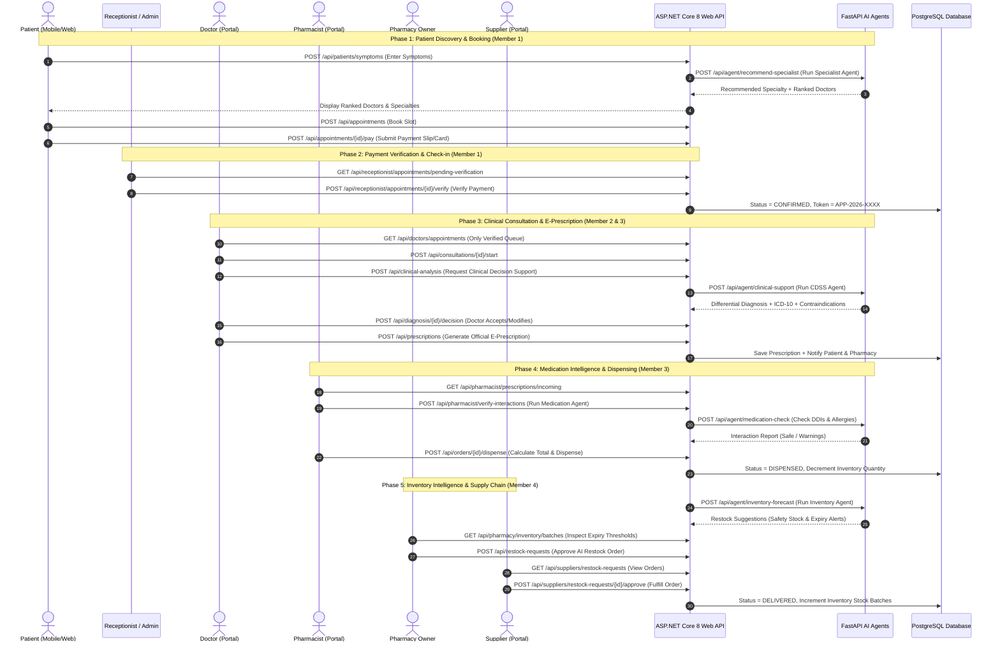
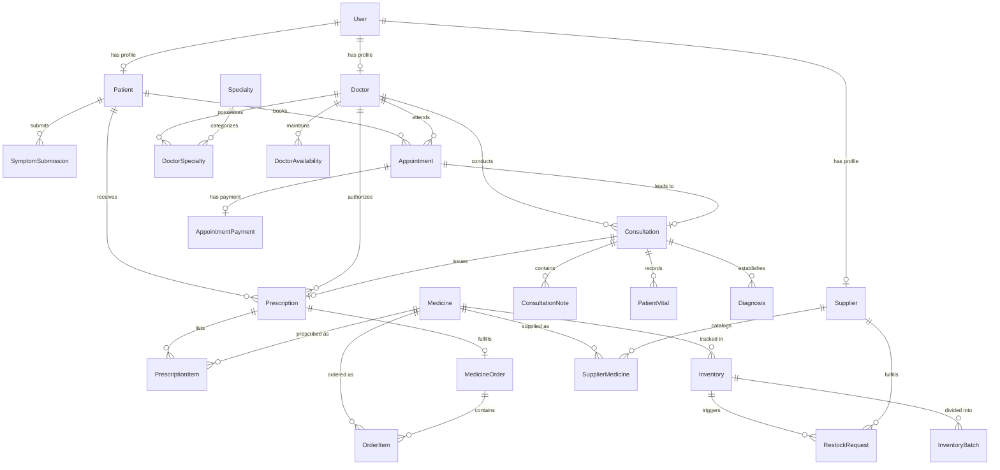

# MediFlow AI — 4-Member Project Division & Technical Specification
## Intelligent Channeling, E-Prescription & Pharmacy Management System
### SE3090 Comprehensive System Architecture & Engineering Reference

---

## Executive Summary & System Vision

**MediFlow AI** is an enterprise-grade, integrated healthcare channeling, clinical consultation, e-prescription, and pharmaceutical supply chain ecosystem. Designed as a comprehensive 4-member full-stack engineering project, the platform unifies patient discovery, appointment booking, payment verification, clinical decision-making, prescription distribution, pharmaceutical dispensing, inventory intelligence, and supplier fulfillment into a cohesive, secure, and resilient system.

At the core of MediFlow AI is a strict **Human-in-the-Loop (HITL) Agentic AI Architecture**. While specialized AI agents automate cognitive, analytical, and operational overhead—such as symptom-to-specialist matching, clinical differential diagnosis, drug-drug interaction screening, and predictive inventory restock calculations—**all critical medical, legal, financial, and pharmaceutical decisions remain solely under the authority of licensed human professionals.**

```
                                  MEDIFLOW AI ECOSYSTEM OVERVIEW
  ┌─────────────────────────────────────────────────────────────────────────────────────────────┐
  │                                     CLIENT INTERFACES                                       │
  │   Mobile: Flutter (Dart / Riverpod)   │   Web: React 19 (TypeScript / Vite / Tailwind CSS)  │
  └──────────────────────────────────────┬──────────────────────────────────────────────────────┘
                                         │ HTTPS / WSS (REST / JSON)
                                         ▼
  ┌─────────────────────────────────────────────────────────────────────────────────────────────┐
  │                           ASP.NET CORE 8 LTS WEB API GATEWAY                                │
  │        JWT Authentication & RBAC │ Global Exception Middleware │ EF Core 8 ORM              │
  └──────────────────┬───────────────────────────────────────────┬──────────────────────────────┘
                     │ Internal REST                             │ Connection Pooling
                     ▼                                           ▼
  ┌──────────────────────────────────────┐    ┌─────────────────────────────────────────────────┐
  │    FASTAPI / LANGGRAPH AI ENGINE     │    │            POSTGRESQL 16 DATABASE               │
  │  4 Autonomous HITL Agent Subsystems  │    │  Relational Data Store, Constraints & Indexes   │
  └──────────────────────────────────────┘    └─────────────────────────────────────────────────┘
```

---

## Enterprise Technology Stack

| Layer / Subsystem | Technology | Specification / Standard | Architectural Role |
|---|---|---|---|
| **Mobile Client** | **Flutter (v3.20+) / Dart** | Riverpod State Management, GoRouter, Material 3 | Patient discovery, mobile booking, live queue tracking, digital e-prescriptions |
| **Web Frontend** | **React 19 / TypeScript 5** | Vite 8, Tailwind CSS 4, TanStack Query v5, Zustand 5, Lucide Icons | Responsive portals for Patient, Receptionist, Admin, Doctor, Pharmacist, Owner, Supplier |
| **Backend API Gateway** | **ASP.NET Core 8 LTS / C# 12** | RESTful Controllers, RFC 7807 Problem Details, Health Checks, Dependency Injection | Central business logic, authorization, transactional integrity, audit logging |
| **Database & ORM** | **PostgreSQL 16 / EF Core 8** | Code-First Migrations, DatabaseSeeder, Connection Pooling, Strict Foreign Keys | Relational data persistence, ACID transactions, data consistency |
| **Authentication & Security** | **JWT Bearer & BCrypt** | Role-Based Access Control (RBAC), Claims Authorization, HMAC-SHA256, CORS | Token issuance, claim validation, password hashing, route protection |
| **Agentic AI Subsystem** | **Python 3.11 / FastAPI / LangGraph** | StateGraph workflows, Pydantic v2 validation, Async HTTP microservice | Cognitive reasoning, clinical NLP, ranking algorithms, predictive forecasting |
| **Containerization & Infra** | **Docker & Docker Compose** | Multi-stage Dockerfiles, Docker Compose multi-service network, Alpine Linux | Reproducible development, production runtime orchestration, isolation |
| **CI/CD & DevSecOps** | **GitHub Actions** | GitHub Actions (`ci.yml`, `cd.yml`), SonarQube / Trivy security scanning, Branch hooks | Automated build, linting, xUnit testing, container publishing, deployment |
| **Testing Framework** | **xUnit, Moq, Vitest, Pytest** | In-Memory EF Core, `WebApplicationFactory`, React Testing Library, Pytest-AsyncIO | Comprehensive unit, integration, frontend, and AI agent test suites |

> **Architectural Law:** React Web and Flutter Mobile communicate **exclusively** through the ASP.NET Core 8 Web API. The Python FastAPI AI Subsystem operates as an **internal microservice** queried strictly by ASP.NET Core via secured internal HTTP channels. No client ever connects directly to the AI service or database.

---

## User Roles & RBAC Matrix

The system enforces strict Role-Based Access Control across seven distinct personas:

| Role Code | Primary Persona | Portal / Platform | Key Responsibilities & Capabilities |
|---|---|---|---|
| `PATIENT` | Clinic Patients | Flutter Mobile & React Web | Symptom entry, AI specialist recommendation, doctor booking, payments, e-prescription viewer, ratings |
| `RECEPTIONIST` | Clinic Staff | React Web | Payment verification queue, check-in, token generation (`APP-YYYY-XXXX`), doctor schedule monitor |
| `ADMINISTRATOR` | System Administrator | React Web | Global user management, specialty provisioning, system health telemetry, audit logging, agent monitoring |
| `DOCTOR` | Medical Doctors | React Web | Verified appointment queue, clinical examination, EHR review, AI clinical decision support, e-prescribing |
| `PHARMACIST` | Licensed Pharmacists | React Web | Digital e-prescription intake, AI medication intelligence check, pricing breakdown, drug dispensing |
| `PHARMACY_OWNER` | Pharmacy Proprietor | React Web | Pharmacy business metrics, real-time inventory, batch expiry tracking, restock order approvals |
| `SUPPLIER` | Drug Distributor | React Web | Restock request management, order fulfillment, delivery tracking, drug catalog pricing updates |

---

## 4-Member Project Division & Primary Ownership

| Member | Primary Portals & Workflows | Agentic AI Subsystem | Platform & Engineering Infrastructure Ownership |
|---|---|---|---|
| **Member 1**<br>*(Dilshan Pasindu)* | 👤 **Patient Portal** (Web & Mobile)<br>🏢 **Receptionist Portal** (Web)<br>🛡️ **Admin Portal** (Web) | 🩺 **Specialist & Doctor Recommendation Agent** | • **All Testing Frameworks** (xUnit, Moq, Integration, Vitest)<br>• **GitHub Actions & CI/CD Pipelines** (`ci.yml`, `cd.yml`)<br>• **PostgreSQL Database Architecture & Migrations** (`AppDbContext`, Seeder)<br>• **Authentication & Global Security** (JWT, BCrypt, RBAC, Claims)<br>• **Docker Infrastructure** (Multi-stage Dockerfiles, Docker Compose) |
| **Member 2**<br>*(Thumula)* | 🩺 **Doctor Portal** (Web) | 🧠 **Clinical Decision Support Agent** | • Doctor consultation workflow & Electronic Health Records (EHR)<br>• Clinical vitals & lab results recording<br>• Differential diagnosis suggestion & doctor decision logging (`ACCEPT`/`MODIFY`/`REJECT`) |
| **Member 3**<br>*(Kusalya Methpani)* | 💊 **Pharmacist Portal** (Web) | 💊 **Medication Intelligence Agent** | • E-Prescription intake & validation workflow<br>• Automated price calculation & medicine order billing<br>• Drug-drug interaction (DDI) & allergy contraindication verification<br>• Medicine dispensing lifecycle (`PENDING` → `IN_PROGRESS` → `DISPENSED`) |
| **Member 4**<br>*(Maneesha Pramodini)* | 🏪 **Pharmacy Owner Portal** (Web)<br>🚚 **Supplier Portal** (Web) | 📦 **Pharmacy & Inventory Intelligence Agent** | • Pharmacy inventory monitoring & batch management with expiry date pickers<br>• Real-time batch expiry threshold calculations (`EXPIRED`, `CRITICAL`, `EXPIRING_SOON`, `GOOD`)<br>• Predictive demand forecasting & automated restock recommendations<br>• Supplier fulfillment & restock order lifecycle management |

---

## Complete End-to-End System Workflow

### High-Level Architecture & Sequence Flow



---

## Detailed Specifications by Team Member

---

### Member 1: Dilshan Pasindu
#### Patient Portal, Receptionist Portal, Admin Portal, Specialist Recommendation Agent & Core Platform Infrastructure

#### 1. Software Engineering Ownership
Member 1 provides the foundational architecture for the entire MediFlow AI ecosystem, ensuring database consistency, authentication security, containerized orchestration, CI/CD pipelines, and global testing standards.

##### A. Portals Managed
1. **Patient Portal (Flutter Mobile + React Web)**:
   - Comprehensive symptom input interface with pain scales, duration, and anatomical body map selector.
   - AI specialist recommendation display with interactive doctor cards, availability calendar, and consultation fee breakdown.
   - Multi-step appointment booking wizard with payment gateway integration and receipt upload.
   - Real-time queue tracker showing current serving token number, estimated wait time, and appointment status (`PENDING_PAYMENT`, `PAYMENT_VERIFIED`, `IN_CONSULTATION`, `COMPLETED`, `CANCELLED`).
   - Digital e-prescription viewer with QR code verification and downloadable PDF view.
   - Doctor rating and review submission interface.

2. **Receptionist Portal (React Web)**:
   - Live queue management dashboard displaying daily patient flow, doctor room assignments, and appointment states.
   - Payment verification workspace allowing staff to inspect uploaded bank slips or payment gateway receipts.
   - Token generation engine issuing sequenced daily clinic tokens (`APP-YYYY-XXXX`).
   - Physical walk-in patient check-in and quick registration modal.
   - Rescheduling and emergency cancellation management with SMS/notification dispatch triggers.

3. **Admin Portal (React Web)**:
   - Executive system overview displaying active users, daily appointments, total revenue, and system health status.
   - Role-Based User Management (create, deactivate, assign roles, reset credentials for Doctors, Pharmacists, Receptionists, and Suppliers).
   - Medical Specialty & Clinic Management (add specialties, manage consulting rooms, configure clinic hours).
   - Security Audit Log Explorer tracking critical events (logins, role elevations, prescription dispensations, inventory adjustments).
   - AI Agent Health & Telemetry Monitor (latency metrics, token consumption, fallback rates, error traces).

##### B. Platform & Infrastructure Ownership
- **PostgreSQL 16 Database Architecture**: Master `AppDbContext` definition, Code-First Fluent API entity configurations, foreign key constraints, composite indexes, and idempotent `DatabaseSeeder.cs` provisioning initial admin, doctor, pharmacist, and medicine data.
- **Authentication & Global Security**: Centralized JWT Bearer token generation, refresh token rotation, BCrypt password hashing, Claims-based authorization handlers, and RFC 7807 compliant global exception handling middleware.
- **Docker & Containerization**: Multi-stage production Dockerfiles for `backend`, `web`, and `ai` services, alongside unified `docker-compose.yml` defining environment configurations, internal bridge networking, and persistent volume storage.
- **GitHub Actions & CI/CD Pipelines**: Authoring and maintaining `ci.yml` (automated code formatting, static analysis, unit/integration test execution) and `cd.yml` (Docker image build, security scanning with Trivy, GHCR publication, and deployment).
- **Global Testing Framework**: Architecting the testing harness, mocking patterns, and implementing xUnit and Vitest test suites.

#### 2. ASP.NET Core API Endpoints Owned by Member 1

```text
# Authentication & Identity (Global Platform)
POST   /api/auth/register                       # Register new patient account
POST   /api/auth/login                          # Authenticate user & return JWT + Refresh Token
POST   /api/auth/refresh-token                  # Rotate refresh token and issue new JWT
GET    /api/auth/me                             # Retrieve authenticated user claims & profile

# Patient Profile & Medical Details
GET    /api/patients/{id}                       # Retrieve patient demographic & medical details
PUT    /api/patients/{id}                       # Update patient emergency contacts & vitals history
GET    /api/patients/me                         # Get profile of currently logged-in patient

# Symptom Ingestion & Doctor Discovery
POST   /api/patients/symptoms                   # Ingest symptom text, duration, and severity payload
GET    /api/doctors                             # Filter doctors by specialty, rating, and fee
GET    /api/doctors/{id}                        # Retrieve public doctor clinical profile
GET    /api/doctors/{id}/availability           # Retrieve available time slots for scheduling

# Appointment Booking & Patient Queue
POST   /api/appointments                        # Create appointment draft with PENDING_PAYMENT status
GET    /api/appointments/my                     # Retrieve authenticated patient's appointment history
GET    /api/appointments/{id}                   # Retrieve comprehensive appointment details
POST   /api/appointments/{id}/pay               # Submit card payment or upload payment receipt

# Receptionist Operations
GET    /api/receptionist/appointments/pending   # Fetch appointments awaiting payment verification
POST   /api/receptionist/appointments/{id}/verify # Verify payment, generate token (APP-YYYY-XXXX)
POST   /api/receptionist/appointments/walk-in   # Register walk-in patient & book immediate slot
PATCH  /api/receptionist/appointments/{id}/reschedule # Reschedule appointment slot
PATCH  /api/receptionist/appointments/{id}/cancel # Cancel appointment with reason log

# Admin Portal Management
GET    /api/admin/dashboard/stats               # System-wide metrics (users, appointments, revenue)
GET    /api/admin/users                         # Paginated user management table with search & filter
PATCH  /api/admin/users/{id}/status             # Activate / deactivate user account
POST   /api/admin/specialties                   # Provision new medical specialty
GET    /api/admin/audit-logs                    # Query security audit logs with timestamp filtering
GET    /api/admin/agent-telemetry               # Telemetry on AI latency, calls, and fallback events
```

#### 3. Database Entities Owned by Member 1
- `User`: Central identity store (Email, PasswordHash, Role, FullName, PhoneNumber, IsActive, CreatedAt).
- `Patient`: Patient demographics (UserId, NIC, DateOfBirth, Gender, BloodGroup, EmergencyContact, Address).
- `Specialty`: Medical disciplines (Id, Name, Description, Icon, IsActive).
- `DoctorSpecialty`: Relational link between doctors and medical specialties.
- `Appointment`: Central scheduling entity (Id, AppointmentNumber, PatientId, DoctorId, SlotTime, Status, QueueToken).
- `AppointmentPayment`: Financial records (Id, AppointmentId, Amount, PaymentMethod, TransactionRef, SlipUrl, IsVerified).
- `SymptomSubmission`: Ingested patient symptoms (Id, PatientId, RawText, DurationDays, SeverityScale, Timestamp).
- `AuditLog`: System-wide security tracking (Id, UserId, Action, EntityName, Timestamp, IpAddress).

#### 4. Agentic AI Ownership: 🩺 Specialist & Doctor Recommendation Agent
- **Microservice Subsystem**: Implemented in Python 3.11 with FastAPI and LangGraph.
- **Workflow & State Graph**:
  1. **Input Normalization**: Ingests raw patient symptom narrative, duration, patient age, and pain severity.
  2. **Emergency Triage Node**: Evaluates symptoms against high-risk clinical red-flags (e.g., severe crushing chest pain, sudden unilateral numbness, acute respiratory failure). If detected, halts regular booking and triggers **Emergency Protocol Alert** directing user to immediate emergency care.
  3. **Clinical Extraction Node**: Extracts standardized clinical terminology and maps symptoms to probable medical conditions using NLP.
  4. **Specialty Classifier Node**: Scores and ranks medical specialties (e.g., Cardiology, Dermatology, Orthopedics, Neurology) with confidence intervals.
  5. **Doctor Scoring & Ranking Node**: Cross-references top specialties against active doctors in PostgreSQL, ranking candidates based on a multi-factor scoring function:
     $$\text{Score} = w_1 \cdot \text{Availability} + w_2 \cdot \text{DoctorRating} + w_3 \cdot \text{Proximity} - w_4 \cdot \text{ConsultationFee}$$
  6. **Human-in-the-Loop Safe Fallback**: If symptom confidence is below 60%, the agent falls back to recommending a **General Physician / Internal Medicine** specialist with a transparent explanation for the patient.

---

### Member 2: Thumula
#### Doctor Portal, Clinical Workspace & Clinical Decision Support Agent

#### 1. Software Engineering Ownership
Member 2 oversees the complete clinical consultation lifecycle, empowering doctors with verified patient queues, digital consultation workspaces, past medical history analysis, vital sign tracking, and AI-assisted clinical decision support.

##### Portals Managed
- **Doctor Portal (React Web)**:
  - Doctor workspace dashboard displaying verified daily patient appointments filtered by consultation room.
  - Active Consultation Room featuring real-time clinical notes recording, ICD-10 diagnosis selection, and vital signs capture (Blood Pressure, Heart Rate, SpO2, Temperature, Blood Glucose, BMI).
  - Patient Longitudinal Health Record (EHR) viewer displaying past clinic visits, known allergies, chronic conditions, and previous medication histories.
  - Interactive AI Clinical Decision Support panel displaying differential diagnoses with evidence citations.
  - Doctor Availability Scheduler enabling doctors to open, close, and adjust consultation time slots and session capacities.

#### 2. ASP.NET Core API Endpoints Owned by Member 2

```text
# Doctor Consultation Queue
GET    /api/doctors/appointments               # Retrieve doctor's confirmed & verified appointment queue
GET    /api/consultations/{appointmentId}      # Retrieve active consultation workspace by appointment

# Clinical Record & Vitals Management
POST   /api/consultations                      # Initialize formal consultation session
PUT    /api/consultations/{id}/notes           # Save subjective/objective clinical examination notes
POST   /api/consultations/{id}/vitals          # Record patient physiological vitals
GET    /api/patients/{id}/clinical-history     # Retrieve past consultations, diagnoses, and allergies

# Clinical Decision Support System (CDSS)
POST   /api/consultations/{id}/clinical-analysis # Query AI Agent for differential diagnosis suggestions
POST   /api/consultations/{id}/diagnosis-decision # Record doctor's final decision (ACCEPT, MODIFY, REJECT)

# Doctor Availability & Schedule Management
GET    /api/doctors/me/schedule                # Retrieve doctor's scheduled time slots
POST   /api/doctors/me/schedule                # Provision recurring or ad-hoc availability slots
DELETE /api/doctors/me/schedule/{slotId}       # Remove or block an availability time slot
```

#### 3. Database Entities Owned by Member 2
- `Doctor`: Doctor credentials (UserId, MedicalLicenseNumber, Qualifications, ConsultationFee, RoomNumber).
- `DoctorAvailability`: Availability time blocks (Id, DoctorId, DayOfWeek, StartTime, EndTime, MaxPatients).
- `DoctorRating`: Patient reviews (Id, DoctorId, PatientId, RatingValue, ReviewComment, CreatedAt).
- `Consultation`: Active clinical session (Id, AppointmentId, DoctorId, StartedAt, CompletedAt, ConsultationStatus).
- `ConsultationNote`: Clinical documentation (Id, ConsultationId, ChiefComplaint, ClinicalObservations, TreatmentPlan).
- `PatientVital`: Physical vitals log (Id, ConsultationId, SystolicBp, DiastolicBp, PulseRate, SpO2, Temperature, Weight).
- `Diagnosis`: Official diagnosis record (Id, ConsultationId, Icd10Code, DiagnosisName, DoctorNotes, DecisionType).

#### 4. Agentic AI Ownership: 🧠 Clinical Decision Support Agent
- **Microservice Subsystem**: Implemented in Python 3.11 with FastAPI and LangGraph.
- **Workflow & State Graph**:
  1. **Clinical Context Assembly**: Ingests patient age, gender, reported symptoms, recorded vitals, known drug allergies, and past medical history.
  2. **Differential Diagnosis Generation**: Synthesizes clinical signals to produce top-3 differential diagnoses tagged with corresponding ICD-10 codes and confidence percentages.
  3. **Clinical Red-Flag & Alert Engine**: Evaluates recorded vitals against standard physiological warning thresholds (e.g., hypertensive crisis, septic shock indicators, severe hypoxia).
  4. **Human-in-the-Loop Safeguard**: **Strict Advisory Mandate**. The AI agent cannot write to the official medical record. The attending doctor must explicitly review every suggestion, choose whether to `ACCEPT`, `MODIFY`, or `REJECT` each item, and sign the diagnosis with their clinical credentials.

---

### Member 3: Kusalya Methpani
#### Pharmacist Portal, E-Prescription Distribution & Medication Intelligence Agent

#### 1. Software Engineering Ownership
Member 3 manages the pharmaceutical distribution pipeline, bridging the clinical consultation room and the dispensary. This includes official digital e-prescription generation, prescription queue management, drug interaction screening, order pricing calculation, and the multi-state dispensing lifecycle.

##### Portals Managed
- **Pharmacist Portal (React Web)**:
  - Incoming E-Prescription Queue displaying active prescriptions transmitted directly from doctor consultation rooms.
  - Digital Prescription Verification Workspace featuring doctor license verification, prescribed item details, dosage, frequency, and duration.
  - Automated Drug-Drug Interaction (DDI) & Allergy Screening report generated by the Medication Intelligence Agent.
  - Automated Billing & Order Pricing Calculator computing line-item totals, applicable taxes, and final payable amounts based on live medicine unit prices.
  - Dispensing Status Manager updating orders across defined states (`PENDING` → `IN_DISPENSING` → `READY_FOR_PICKUP` → `DISPENSED`).

#### 2. ASP.NET Core API Endpoints Owned by Member 3

```text
# Medicine Catalog & Formulations
GET    /api/medicines                          # Search master medicine catalog (brand, generic, strength)
GET    /api/medicines/{id}                     # Retrieve detailed medicine profile and standard pricing

# E-Prescription Management
POST   /api/prescriptions                      # Generate and sign official e-prescription (Doctor)
GET    /api/prescriptions/{id}                 # Retrieve e-prescription details with line items
GET    /api/prescriptions/patient/{patientId}  # Retrieve patient's e-prescription history
GET    /api/pharmacist/prescriptions/inbox     # Retrieve incoming unfulfilled prescription queue

# Medication Intelligence Screening
POST   /api/prescriptions/{id}/screen-interactions # Run Medication Agent for DDIs & allergy warnings

# Order Processing & Dispensing
POST   /api/orders/from-prescription/{rxId}    # Convert verified e-prescription into a medicine order
GET    /api/orders/{id}                        # Retrieve medicine order breakdown with line-item pricing
PATCH  /api/orders/{id}/dispense-status        # Update dispensing state (IN_PROGRESS, DISPENSED)
POST   /api/orders/{id}/complete-dispense      # Finalize drug handover and trigger stock decrement
```

#### 3. Database Entities Owned by Member 3
- `Prescription`: Official digital prescription (Id, ConsultationId, DoctorId, PatientId, IssuedAt, ExpiryDate, DigitalSignature).
- `PrescriptionItem`: Prescribed drugs (Id, PrescriptionId, MedicineId, Dosage, Frequency, DurationDays, Instructions).
- `MedicineOrder`: Dispensary order (Id, PrescriptionId, PatientId, PharmacistId, TotalAmount, OrderStatus, DispensedAt).
- `OrderItem`: Line items for order (Id, MedicineOrderId, MedicineId, QuantityPrescribed, UnitPrice, Subtotal).
- `DrugInteractionLog`: Safety audit records (Id, PrescriptionId, DrugA, DrugB, SeverityLevel, PharmacistOverrideNote).

#### 4. Agentic AI Ownership: 💊 Medication Intelligence Agent
- **Microservice Subsystem**: Implemented in Python 3.11 with FastAPI and LangGraph.
- **Workflow & State Graph**:
  1. **Prescription Parsing**: Ingests all prescribed medicines, dosage strengths, administration routes, and planned durations.
  2. **Drug-Drug Interaction (DDI) Cross-Check**: Checks prescribed drug combinations against a clinical interaction database to flag Major, Moderate, or Minor interactions.
  3. **Patient Allergy Verification**: Cross-checks prescribed substances against the patient's recorded allergy profile (e.g., Penicillin, Sulfonamides, NSAIDs).
  4. **Dosage & Safety Guardrails**: Flags abnormally high dosages based on patient age and standard clinical ranges.
  5. **Generic Alternative Advisory**: If a prescribed drug is out of stock in the pharmacy, the agent suggests bioequivalent generic alternatives with matching strengths.
  6. **Human-in-the-Loop Safeguard**: Pharmacists must formally acknowledge all warnings. If a major interaction is detected, dispensing is blocked until the pharmacist enters an override justification or consults the prescribing doctor.

---

### Member 4: Maneesha Pramodini
#### Pharmacy Owner Portal, Supplier Portal, Inventory Management & Pharmacy Intelligence Agent

#### 1. Software Engineering Ownership
Member 4 controls the pharmaceutical supply chain and business operations, handling real-time multi-batch inventory tracking, expiration date monitoring, automated restock request workflows, and supplier order fulfillment.

##### Portals Managed
1. **Pharmacy Owner Portal (React Web)**:
   - Executive Business Overview showing daily sales, inventory valuation, out-of-stock items, and pending restock orders.
   - Comprehensive Inventory Dashboard with real-time stock levels, reorder thresholds, and unit costs.
   - Real-World Batch Expiry Tracking Workspace featuring date pickers, batch creation modals, and dynamic visual indicators classifying batches into **Expired**, **Critical**, **Expiring Soon**, or **Good** states.
   - AI Restock Recommendation Panel displaying forecast consumption trends, suggested order quantities, and single-click purchase order generation.

2. **Supplier Portal (React Web)**:
   - Incoming Restock Order Queue displaying purchase requests submitted by pharmacy owners.
   - Order Review & Approval Workspace allowing suppliers to confirm stock availability, accept orders, or indicate backorders.
   - Catalog & Pricing Management enabling suppliers to maintain medicine availability, pack sizes, and wholesale pricing.
   - Shipment & Fulfillment Tracker updating orders through delivery milestones (`APPROVED` → `DISPATCHED` → `DELIVERED`).

#### 2. ASP.NET Core API Endpoints Owned by Member 4

```text
# Inventory Management & Batch Tracking
GET    /api/inventory                          # List inventory items with stock levels, categories, filters
GET    /api/inventory/{id}                     # Retrieve detailed stock profile with full batch breakdown
POST   /api/inventory/{id}/batches             # Create new batch with BatchNumber, Quantity, ExpiryDate
PUT    /api/inventory/{id}/batches/{batchId}/expiry # Update batch expiration date using date picker
GET    /api/inventory/low-stock                # Retrieve items below minimum safety threshold
GET    /api/inventory/expiry-alerts            # Retrieve items with batches in CRITICAL or EXPIRED status

# Restock Workflow (Pharmacy Owner)
GET    /api/restock-requests                   # Retrieve pharmacy restock requests and order statuses
POST   /api/restock-requests                   # Create restock purchase order for supplier submission
PATCH  /api/restock-requests/{id}/approve      # Pharmacy owner signs off on purchase order

# Supplier Operations (Supplier Portal)
GET    /api/suppliers/me/orders                # Retrieve supplier's incoming restock order queue
PATCH  /api/suppliers/orders/{id}/status       # Update order status (APPROVED, DISPATCHED, REJECTED)
GET    /api/suppliers/catalog                  # Retrieve and manage supplier medicine catalog
PUT    /api/suppliers/catalog/pricing          # Update wholesale unit prices and available pack quantities

# Inventory Intelligence & Forecasting
GET    /api/inventory/analytics/forecast       # Retrieve AI-generated demand forecast & restock suggestions
```

#### 3. Database Entities Owned by Member 4
- `Medicine`: Master pharmaceutical formulations (Id, BrandName, GenericName, Category, UnitPrice, RequiresPrescription).
- `Inventory`: Pharmacy inventory tracking (Id, MedicineId, CurrentStock, MinStockLevel, ReorderQuantity, LastRestockedAt).
- `InventoryBatch`: Individual drug batches (Id, InventoryId, BatchNumber, Quantity, ExpiryDate, Status, CreatedAt).
- `Supplier`: Registered distributor profiles (Id, UserId, CompanyName, ContactPerson, Phone, Address, IsApproved).
- `SupplierMedicine`: Supplier product offerings (Id, SupplierId, MedicineId, WholesalePrice, LeadTimeDays, InStock).
- `RestockRequest`: Purchase orders (Id, InventoryId, SupplierId, RequestedQuantity, TotalCost, Status, OrderDate).

#### 4. Agentic AI Ownership: 📦 Pharmacy & Inventory Intelligence Agent
- **Microservice Subsystem**: Implemented in Python 3.11 with FastAPI and LangGraph.
- **Workflow & State Graph**:
  1. **Historical Consumption Ingestion**: Ingests past 90 days of prescription dispensation logs and medicine order rates.
  2. **Seasonal & Velocity Trend Analysis**: Evaluates dispensing velocity and seasonality patterns (e.g., antihistamines in spring, antibiotics during flu season).
  3. **Batch Expiry Depletion Modeling**: Models First-Expiring-First-Out (FEFO) dispensing to flag batches at risk of expiring before full consumption.
  4. **Dynamic Safety Stock & Reorder Calculation**:
     $$\text{Reorder Quantity} = (\text{Daily Consumption Rate} \times \text{Supplier Lead Time}) + \text{Safety Stock Buffer} - \text{Current Usable Stock}$$
  5. **Automated Purchase Order Draft Generation**: Compiles items into structured restock orders grouped by preferred supplier.
  6. **Human-in-the-Loop Safeguard**: The agent cannot issue legal financial purchase orders autonomously. The **Pharmacy Owner must review, adjust, and approve** all recommended quantities before transmission to suppliers.

---

## Cross-Platform Full-Stack Architecture

### 1. ASP.NET Core 8 Web API Gateway
- Centralized enterprise architecture built with C# 12 and .NET 8 LTS.
- **Clean Architecture Layers**:
  - `MediFlow.Api/Controllers`: Thin REST controllers handling HTTP parsing, authorization attributes, and model validation.
  - `MediFlow.Api/Services`: Core business logic services (`InventoryService`, `AuthService`, `AppointmentService`, etc.) implementing isolated interfaces.
  - `MediFlow.Api/Data`: Entity Framework Core `AppDbContext` mapping 20+ relational entities with fluent configurations.
  - `MediFlow.Api/DTOs`: Strongly-typed Data Transfer Objects strictly separating internal domain entities from public API contracts.
  - `MediFlow.Api/Middleware`: RFC 7807 Problem Details error handler, performance request timer, and audit logger.

### 2. React 19 Frontend Web Portals
- Developed with TypeScript in Strict Mode, built with Vite 8.
- **Modular Portal Architecture**:
  - `pages/patient`: Patient dashboard, booking flow, symptom consultation.
  - `pages/receptionist`: Receptionist live queue and payment verification.
  - `pages/admin`: Global user management, specialty provisioning, audit logs.
  - `pages/doctor`: Doctor consultation workspace, EHR viewer, e-prescriptions.
  - `pages/pharmacist`: Pharmacist prescription inbox and dispensing calculator.
  - `pages/pharmacyowner`: Owner dashboard, multi-batch expiry picker, restock views.
  - `pages/supplier`: Supplier restock order fulfillment and catalog manager.
- **State & Data Management**: TanStack Query v5 for server-state caching, background revalidation, and optimistic updates; Zustand 5 for lightweight client auth session state.
- **Design System**: Tailored Tailwind CSS 4 with custom design tokens, modern typography (`Inter` & `Outfit`), CSS glassmorphism, responsive grid layouts, and micro-animations.

### 3. Flutter Mobile Application
- Built with Dart and Flutter (v3.20+) using Riverpod for unidirectional state management and GoRouter for declarative routing.
- Dedicated to the **Patient** journey:
  - Symptom submission with native date pickers and anatomical symptom selectors.
  - GPS-enabled location discovery to calculate distance to nearby medical centers and pharmacies.
  - Push notifications for appointment token updates, queue status changes, and prescription readiness alerts.
  - Offline-capable SQLite caching for active appointment tokens and past e-prescriptions.

### 4. FastAPI & LangGraph AI Subsystem
- Standalone asynchronous Python 3.11 microservice running Uvicorn.
- Powered by **LangGraph StateGraph** architectures defining cyclic, stateful agentic workflows with explicit error branches, validation nodes, and fallback policies.
- Pydantic v2 schemas guaranteeing typed JSON payload serialization matching ASP.NET Core DTOs.

---

## PostgreSQL 16 Relational Database Architecture



---

## Infrastructure, DevOps & Testing Framework (Owned by Member 1)

### 1. Multi-Stage Docker Container Architecture
Member 1 engineered optimized, secure, multi-stage Docker configurations to ensure lightweight production runtime environments:

#### A. Backend API Dockerfile (`backend/Dockerfile`)
- **Stage 1 (Build)**: Uses `mcr.microsoft.com/dotnet/sdk:8.0-alpine` to restore dependencies, compile C# binaries in `Release` mode, and publish optimized assemblies.
- **Stage 2 (Runtime)**: Uses `mcr.microsoft.com/dotnet/aspnet:8.0-alpine` containing only the lightweight runtime. Executes as a non-root user (`app`), exposing ports 8080 and 8081 with built-in HTTP health check probes.

#### B. Web Frontend Dockerfile (`web/Dockerfile`)
- **Stage 1 (Build)**: Uses `node:20-alpine` to install dependencies via `npm ci` and compile production static bundles via `npm run build`.
- **Stage 2 (Runtime)**: Uses `nginx:alpine` to serve static assets with gzip compression, security headers (CSP, X-Frame-Options), and SPA HTML5 fallback routing.

#### C. AI Subsystem Dockerfile (`ai/Dockerfile`)
- Uses `python:3.11-slim` with virtual environments, non-root user execution, and pinned dependencies via `requirements.txt`.

#### D. Orchestration (`docker-compose.yml`)
Orchestrates four interlinked containers on an isolated bridge network (`mediflow-net`):
1. `mediflow-db`: PostgreSQL 16 with persistent volume mounting (`postgres-data`).
2. `mediflow-api`: ASP.NET Core 8 API with health-check dependency on database readiness.
3. `mediflow-ai`: FastAPI AI microservice exposed only to internal services.
4. `mediflow-web`: Nginx web server reverse-proxying API traffic to the backend.

---

### 2. GitHub Actions CI/CD & DevSecOps Workflows (`ci.yml` & `cd.yml`)
Member 1 designed and maintains automated GitHub Actions pipelines:

```
                  GITHUB ACTIONS WORKFLOW ARCHITECTURE
┌─────────────────────────────────────────────────────────────────────────────┐
│                       CONTINUOUS INTEGRATION (ci.yml)                       │
│  Trigger: Pull Request or Push to any branch                                │
│                                                                             │
│  ┌──────────────────┐  ┌──────────────────┐  ┌───────────────────────────┐  │
│  │  Backend Pipeline│  │ Frontend Pipeline│  │   AI Subsystem Pipeline   │  │
│  │  • dotnet format │  │  • npm run lint  │  │   • black / flake8 lint   │  │
│  │  • dotnet build  │  │  • tsc (typecheck│  │   • pytest test suite     │  │
│  │  • xUnit (27/27) │  │  • vitest tests  │  │   • schema verification   │  │
│  └────────┬─────────┘  └────────┬─────────┘  └─────────────┬─────────────┘  │
│           └─────────────────────┼──────────────────────────┘                │
│                                 ▼                                           │
│                 Branch Protection Gate: All Pass?                           │
└─────────────────────────────────┬───────────────────────────────────────────┘
                                  │ Merged into dev / main
                                  ▼
┌─────────────────────────────────────────────────────────────────────────────┐
│                        CONTINUOUS DEPLOYMENT (cd.yml)                       │
│  Trigger: Push to main / dev                                                │
│                                                                             │
│  • Multi-stage Docker Build (Backend, Web, AI)                              │
│  • Trivy Vulnerability Security Container Scan                              │
│  • Tagging & Publishing to GitHub Container Registry (GHCR)                 │
│  • Automated Deployment Health Check Ping                                   │
└─────────────────────────────────────────────────────────────────────────────┘
```

---

### 3. Comprehensive Testing Strategy & Quality Assurance
Member 1 implemented automated testing frameworks across all tiers:

1. **Backend Unit & Service Tests (`tests/MediFlow.Tests`)**:
   - Built with **xUnit**, **Moq**, and **EF Core In-Memory Database Provider**.
   - Tests verify batch creation, stock increment, automated expiry date calculation thresholds (`EXPIRED`, `CRITICAL`, `EXPIRING_SOON`, `GOOD`), appointment status transitions, and authentication claims.
   - **Current Status**: **27/27 tests passing** with 0 failures.

2. **Integration Tests (`WebApplicationFactory`)**:
   - Executes full HTTP requests against an in-memory ASP.NET Core test server, validating authorization attributes, DTO model validation, and RFC 7807 Problem Details formatting.

3. **Frontend Component & Hook Tests (`Vitest`)**:
   - Vitest + React Testing Library verifying modal rendering, form validation, date picker behavior, and TanStack Query state transitions.

4. **AI Microservice Tests (`Pytest`)**:
   - Pytest suites validating Pydantic schemas, emergency triage red-flags, and fallback behavior when clinical inputs are incomplete.

---

## Safe Failure Scenarios & Human-in-the-Loop Safeguards

| Subsystem / Agent | Failure / Edge-Case Scenario | Automated AI Behavior | Human-in-the-Loop Override / Resolution |
|---|---|---|---|
| **Specialist Recommendation** *(Member 1)* | Patient submits ambiguous or vague symptoms (e.g. "I feel tired and weak") | Flags low confidence score (<60%); avoids guessing specialist | Recommends **General Physician**; patient can manually browse all specialists |
| **Specialist Recommendation** *(Member 1)* | Critical emergency symptoms detected (e.g. crushing chest pain, numbness) | Aborts channeling workflow; issues high-priority Emergency Banner | Directs user to call emergency medical services (1990/911) or visit the nearest ER |
| **Clinical Decision Support** *(Member 2)* | Patient presents complex multi-morbidity contradicting standard ICD-10 | Suggests multiple differential diagnoses with low confidence tags | **Doctor retains 100% veto power**; doctor manually types custom diagnosis |
| **Medication Intelligence** *(Member 3)* | Severe fatal drug-drug interaction detected between prescribed medications | Issues high-severity Red Alert; displays clinical pharmacological citation | Dispensing is digitally locked; Pharmacist must contact doctor or enter formal override |
| **Inventory Intelligence** *(Member 4)* | Sudden unexpected surge in medication demand (e.g. seasonal epidemic) | Flags inventory exhaustion risk earlier than static threshold | Pharmacy Owner reviews AI forecast and manually approves/adjusts restock order |
| **Supply Chain** *(Member 4)* | Supplier is out of stock or rejects purchase order request | Updates order status to `REJECTED_OUT_OF_STOCK` and alerts owner | System prompts Owner to reassign order to secondary approved distributor |

---

## Live Demonstration Walkthrough Script

During the final system presentation, the team will demonstrate a complete, connected, human-in-the-loop healthcare journey across all four roles:

1. **Phase 1: Patient Discovery & Booking (Member 1 - Dilshan Pasindu)**:
   - *Patient* opens the portal, enters symptoms ("persistent knee joint pain and swelling for 2 weeks").
   - 🩺 **Specialist Agent** analyzes symptoms, identifies **Orthopedics / Rheumatology**, and ranks top doctors based on rating, distance, and availability.
   - *Patient* selects the doctor, books an appointment slot, and submits payment.

2. **Phase 2: Payment Verification & Check-in (Member 1 - Dilshan Pasindu)**:
   - *Receptionist* views the incoming booking in the verification queue, reviews the payment confirmation, and clicks **Verify**.
   - System confirms the appointment and assigns queue token **`APP-2026-1042`**.

3. **Phase 3: Clinical Consultation & E-Prescription (Member 2 - Thumula)**:
   - *Doctor* logs into the Doctor Portal, sees patient `APP-2026-1042` in the verified queue, and initiates the consultation.
   - *Doctor* records vitals and triggers the 🧠 **Clinical Decision Support Agent**, which suggests differential diagnoses (e.g., Osteoarthritis vs. Meniscal Tear).
   - *Doctor* confirms the diagnosis, selects medications, and digitally signs the **E-Prescription**.

4. **Phase 4: Medication Intelligence & Dispensing (Member 3 - Kusalya Methpani)**:
   - *Pharmacist* opens the Dispensary Portal, receiving the newly issued e-prescription instantly.
   - 💊 **Medication Intelligence Agent** screens the prescription for drug-drug interactions and patient allergies, displaying an all-clear report.
   - *Pharmacist* reviews automated line-item pricing and clicks **Dispense & Complete Order**.

5. **Phase 5: Inventory Tracking & Supplier Restocking (Member 4 - Maneesha Pramodini)**:
   - Drug dispensation decrements pharmacy stock in real-time.
   - 📦 **Pharmacy Inventory Agent** detects that stock has dropped near the reorder point, while simultaneously monitoring batch expiry dates via the interactive date picker.
   - *Pharmacy Owner* reviews the AI restock recommendation on their dashboard and approves the restock purchase order.
   - *Supplier* logs into the Supplier Portal, sees the new purchase request, accepts the order, and updates shipping status to **Dispatched**.

---

## Complete Responsibility Matrix

| Area / Component | Primary Lead | Collaborating Roles | Artifacts & Deliverables |
|---|---|---|---|
| **Patient Portal & Queue** | **Member 1** *(Dilshan)* | All members | Flutter Mobile app, React Patient Dashboard, live queue tracker |
| **Receptionist Portal** | **Member 1** *(Dilshan)* | Member 2 | Receptionist live verification workspace, token engine |
| **Admin Portal & Telemetry** | **Member 1** *(Dilshan)* | All members | System overview, user management, audit explorer, AI metrics |
| **Specialist Recommender Agent**| **Member 1** *(Dilshan)* | Member 2 | LangGraph triage graph, doctor scoring engine, emergency classifier |
| **Doctor Consultation Portal** | **Member 2** *(Thumula)* | Member 1, Member 3 | Consultation workspace, vitals capture, EHR viewer |
| **Clinical Decision Agent (CDSS)**| **Member 2** *(Thumula)* | Member 1 | Differential diagnosis generator, ICD-10 suggestions, HITL decisions |
| **Pharmacist Portal** | **Member 3** *(Kusalya)* | Member 2, Member 4 | Prescription queue, pricing calculator, dispensing manager |
| **Medication Intelligence Agent**| **Member 3** *(Kusalya)* | Member 2 | Drug interaction checker (DDI), allergy checker, generic alternative engine |
| **Pharmacy Owner Portal** | **Member 4** *(Maneesha)*| Member 3 | Inventory dashboard, batch expiry picker, revenue analytics |
| **Supplier Portal** | **Member 4** *(Maneesha)*| Member 4 | Supplier restock queue, catalog pricing editor, shipment tracker |
| **Inventory Intelligence Agent** | **Member 4** *(Maneesha)*| Member 4 | Predictive demand forecasting, batch expiry classifier, restock generator |
| **Database Architecture (Postgres)**| **Member 1** *(Dilshan)* | All members | `AppDbContext`, 20+ entities, EF Core migrations, `DatabaseSeeder.cs` |
| **Auth & Global Security** | **Member 1** *(Dilshan)* | All members | JWT Bearer, BCrypt, RBAC policies, RFC 7807 Problem Details |
| **Docker & Infrastructure** | **Member 1** *(Dilshan)* | All members | Multi-stage Dockerfiles (`backend`, `web`, `ai`), `docker-compose.yml` |
| **GitHub Actions CI/CD** | **Member 1** *(Dilshan)* | All members | `.github/workflows/ci.yml`, `.github/workflows/cd.yml`, branch rules |
| **Testing Strategy & Suites** | **Member 1** *(Dilshan)* | All members | 27 xUnit backend unit tests, `WebApplicationFactory` tests, Vitest tests |

---
*MediFlow AI — Intelligent Channeling, E-Prescription & Pharmacy Management System*
*Comprehensive Technical Reference & Team Engineering Specifications.*
