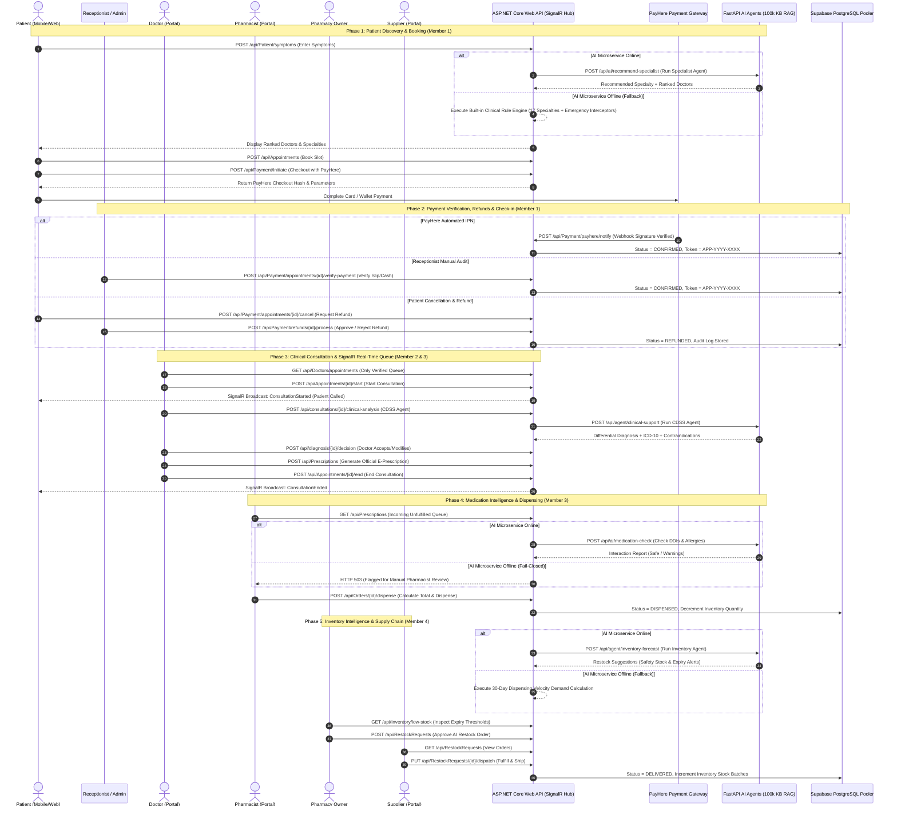
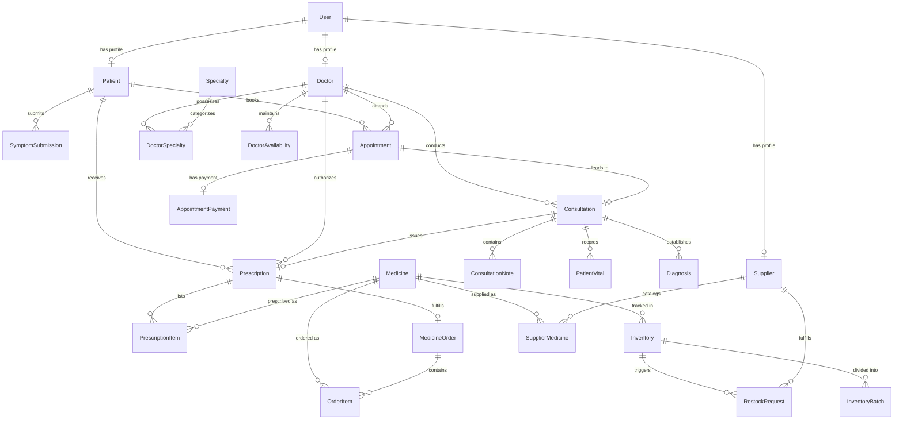

# MediFlow AI — 4-Member Project Division & Technical Specification
## Intelligent Channeling, E-Prescription & Pharmacy Management System
### SE3090 Comprehensive System Architecture & Engineering Reference

---

## Executive Summary & System Vision

**MediFlow AI** is an enterprise-grade, integrated healthcare channeling, clinical consultation, e-prescription, and pharmaceutical supply chain ecosystem. Designed as a comprehensive 4-member full-stack engineering project, the platform unifies patient discovery, appointment booking, payment verification, clinical decision-making, prescription distribution, pharmaceutical dispensing, inventory intelligence, and supplier fulfillment into a cohesive, secure, and resilient system.

At the core of MediFlow AI is a strict **Human-in-the-Loop (HITL) Agentic AI Architecture**. While specialized AI agents automate cognitive, analytical, and operational overhead—such as symptom-to-specialist matching, clinical differential diagnosis, drug-drug interaction screening, and predictive inventory restock calculations—**all critical medical, legal, financial, and pharmaceutical decisions remain solely under the authority of licensed human professionals.**

```
                                  MEDIFLOW AI ECOSYSTEM OVERVIEW
  ┌─────────────────────────────────────────────────────────────────────────────────────────────┐
  │                                     CLIENT INTERFACES                                       │
  │   Mobile: Flutter (Dart / Riverpod)   │   Web: React 19 (TypeScript / Vite / Tailwind CSS)  │
  └──────────────────────────────────────┬──────────────────────────────────────────────────────┘
                                         │ HTTPS / WSS (REST / SignalR WebSockets)
                                         ▼
  ┌─────────────────────────────────────────────────────────────────────────────────────────────┐
  │                           ASP.NET CORE 9 / 8 LTS WEB API GATEWAY                            │
  │   JWT & Supabase Auth │ SignalR Consultation Hub │ Global Problem Details │ EF Core ORM     │
  └──────────────────┬───────────────────────────────────────────┬──────────────────────────────┘
                     │ Internal REST (HTTP)                      │ TLS Pooler (:5432)
                     ▼                                           ▼
  ┌──────────────────────────────────────┐    ┌─────────────────────────────────────────────────┐
  │    FASTAPI / LANGGRAPH AI ENGINE     │    │        SUPABASE POSTGRESQL CLOUD DATABASE       │
  │  4 Autonomous HITL Agent Subsystems  │    │      Session Pooler (IPv4) & Database Health    │
  │  100k Hybrid Medical KB RAG (FTS5)   │    │      29 Production Tables & ACID Transactions   │
  └──────────────────────────────────────┘    └─────────────────────────────────────────────────┘
                     │                                           │
                     └───────────────────┬───────────────────────┘
                                         ▼
                     ┌───────────────────────────────────────┐
                     │     GITHUB ACTIONS KEEP-ALIVE CRON    │
                     │  14-Min Ping: AI Service + Backend    │
                     └───────────────────────────────────────┘
```

---

## Enterprise Technology Stack

| Layer / Subsystem | Technology | Specification / Standard | Architectural Role |
|---|---|---|---|
| **Mobile Client** | **Flutter (v3.20+) / Dart** | Riverpod State Management, GoRouter, Material 3, 60s Cold-Start Timeout | Patient discovery, mobile booking, live queue tracking, digital e-prescriptions |
| **Web Frontend** | **React 19 / TypeScript 5** | Vite 8, Tailwind CSS, TanStack Query v5, Zustand 5, Lucide Icons | Responsive portals for Patient, Receptionist, Admin, Doctor, Pharmacist, Owner, Supplier |
| **Backend API Gateway** | **ASP.NET Core 9 / 8 LTS / C# 12** | RESTful Controllers, RFC 7807 Problem Details, Database Health Checks (`/health`), Dependency Injection | Central business logic, authorization, transactional integrity, audit logging |
| **Real-Time Communication** | **ASP.NET Core SignalR** | WebSockets / Long Polling Hub (`/hubs/consultation`) | Real-time consultation queue updates, patient calling, and live status broadcasting |
| **Payment Gateway & Refunds** | **PayHere Sandbox Gateway** | MD5 Signature Generation, IPN Webhook Verification, Receptionist Manual Audit | Secure online card/wallet checkout, automated IPN status sync, full patient refund lifecycle |
| **Database & ORM** | **Supabase PostgreSQL / EF Core** | AWS Tokyo Session Pooler (`aws-0-ap-northeast-1.pooler.supabase.com:5432`), IPv4 Auto-Routing, 29 Tables | Relational data persistence, ACID transactions, pooler connection resiliency |
| **Authentication & Security** | **JWT Bearer & Supabase Auth** | Dual-Auth Architecture, Role-Based Access Control (RBAC), Claims Authorization, Staff Latency Bypass | Token issuance, claim validation, password hashing, route protection |
| **Agentic AI Subsystem** | **Python 3.12 / FastAPI / LangGraph** | StateGraph workflows, Pydantic v2 validation, 100k Hybrid Medical KB RAG (FTS5 + Semantic) | Cognitive reasoning, clinical NLP, ranking algorithms, predictive forecasting |
| **Reliability & Keep-Alive** | **GitHub Actions Cron Automation** | 14-Minute Scheduled Ping (`keep-ai-alive.yml`) targeting AI Service & Backend | Prevents Render free-tier container dormancy and eliminates cold start delays |
| **Testing Framework** | **xUnit, Moq, Vitest, Pytest** | In-Memory EF Core, `WebApplicationFactory`, React Testing Library, Pytest-AsyncIO | Comprehensive unit, integration, frontend, and AI agent test suites (139 .NET + 109 Pytest passing) |

> **Architectural Law:** React Web and Flutter Mobile communicate **exclusively** through the ASP.NET Core Web API. The Python FastAPI AI Subsystem operates as an **internal microservice** queried strictly by ASP.NET Core via secured internal HTTP channels with automatic offline clinical fallbacks.

---

## User Roles & RBAC Matrix

The system enforces strict Role-Based Access Control across seven distinct personas:

| Role Code | Primary Persona | Portal / Platform | Key Responsibilities & Capabilities |
|---|---|---|---|
| `PATIENT` | Clinic Patients | Flutter Mobile & React Web | Symptom entry, AI specialist recommendation, doctor booking, payments, e-prescription viewer, ratings |
| `RECEPTIONIST` | Clinic Staff | React Web | Payment verification queue, check-in, token generation (`APP-YYYY-XXXX`), doctor schedule monitor |
| `ADMINISTRATOR` | System Administrator | React Web | Global user management, specialty provisioning, system health telemetry, audit logging, agent monitoring |
| `DOCTOR` | Medical Doctors | React Web | Verified appointment queue, clinical examination, EHR review, AI clinical decision support, e-prescribing |
| `PHARMACIST` | Licensed Pharmacists | React Web | Digital e-prescription intake, AI medication intelligence check, pricing breakdown, drug dispensing |
| `PHARMACY_OWNER` | Pharmacy Proprietor | React Web | Pharmacy business metrics, real-time inventory, batch expiry tracking, restock order approvals |
| `SUPPLIER` | Drug Distributor | React Web | Restock request management, order fulfillment, delivery tracking, drug catalog pricing updates |

---

## 4-Member Project Division & Primary Ownership

| Member | Primary Portals & Workflows | Agentic AI Subsystem | Platform & Engineering Infrastructure Ownership |
|---|---|---|---|
| **Member 1**<br>*(Dilshan Pasindu)* | 👤 **Patient Portal** (Web & Mobile)<br>🏢 **Receptionist Portal** (Web)<br>🛡️ **Admin Portal** (Web) | 🩺 **Specialist & Doctor Recommendation Agent** | • **All Testing Frameworks** (xUnit, Moq, Integration, Vitest)<br>• **GitHub Actions & CI/CD Pipelines** (`ci.yml`, `cd.yml`)<br>• **PostgreSQL Database Architecture & Migrations** (`AppDbContext`, Seeder)<br>• **Authentication & Global Security** (JWT, BCrypt, RBAC, Claims)<br>• **Docker Infrastructure** (Multi-stage Dockerfiles, Docker Compose) |
| **Member 2**<br>*(Thumula)* | 🩺 **Doctor Portal** (Web) | 🧠 **Clinical Decision Support Agent** | • Doctor consultation workflow & Electronic Health Records (EHR)<br>• Clinical vitals & lab results recording<br>• Differential diagnosis suggestion & doctor decision logging (`ACCEPT`/`MODIFY`/`REJECT`) |
| **Member 3**<br>*(Kusalya Methpani)* | 💊 **Pharmacist Portal** (Web) | 💊 **Medication Intelligence Agent** | • E-Prescription intake & validation workflow<br>• Automated price calculation & medicine order billing<br>• Drug-drug interaction (DDI) & allergy contraindication verification<br>• Medicine dispensing lifecycle (`PENDING` → `IN_PROGRESS` → `DISPENSED`) |
| **Member 4**<br>*(Maneesha Pramodini)* | 🏪 **Pharmacy Owner Portal** (Web)<br>🚚 **Supplier Portal** (Web) | 📦 **Pharmacy & Inventory Intelligence Agent** | • Pharmacy inventory monitoring & batch management with expiry date pickers<br>• Real-time batch expiry threshold calculations (`EXPIRED`, `CRITICAL`, `EXPIRING_SOON`, `GOOD`)<br>• Predictive demand forecasting & automated restock recommendations<br>• Supplier fulfillment & restock order lifecycle management |

---

## Complete End-to-End System Workflow

### High-Level Architecture & Sequence Flow


```mermaid
sequenceDiagram
    autonumber
    actor Patient as Patient (Mobile/Web)
    participant M1_Rec as Receptionist / Admin
    actor Doctor as Doctor (Portal)
    actor Pharmacist as Pharmacist (Portal)
    actor Owner as Pharmacy Owner
    actor Supplier as Supplier (Portal)
    participant API as ASP.NET Core Web API (SignalR Hub)
    participant PayHere as PayHere Payment Gateway
    participant AI as FastAPI AI Agents (100k KB RAG)
    participant DB as Supabase PostgreSQL Pooler

    Note over Patient,AI: Phase 1: Patient Discovery & Booking (Member 1)
    Patient->>API: POST /api/Patient/symptoms (Enter Symptoms)
    alt AI Microservice Online
        API->>AI: POST /api/ai/recommend-specialist (Run Specialist Agent)
        AI-->>API: Recommended Specialty + Ranked Doctors
    else AI Microservice Offline (Fallback)
        API-->>API: Execute Built-in Clinical Rule Engine (17 Specialties + Emergency Interceptors)
    end
    API-->>Patient: Display Ranked Doctors & Specialties
    Patient->>API: POST /api/Appointments (Book Slot)
    Patient->>API: POST /api/Payment/initiate (Checkout with PayHere)
    API-->>Patient: Return PayHere Checkout Hash & Parameters
    Patient->>PayHere: Complete Card / Wallet Payment

    Note over M1_Rec,DB: Phase 2: Payment Verification, Refunds & Check-in (Member 1)
    alt PayHere Automated IPN
        PayHere->>API: POST /api/Payment/payhere/notify (Webhook Signature Verified)
        API->>DB: Status = CONFIRMED, Token = APP-YYYY-XXXX
    else Receptionist Manual Audit
        M1_Rec->>API: POST /api/Payment/appointments/{id}/verify-payment (Verify Slip/Cash)
        API->>DB: Status = CONFIRMED, Token = APP-YYYY-XXXX
    else Patient Cancellation & Refund
        Patient->>API: POST /api/Payment/appointments/{id}/cancel (Request Refund)
        M1_Rec->>API: POST /api/Payment/refunds/{id}/process (Approve / Reject Refund)
        API->>DB: Status = REFUNDED, Audit Log Stored
    end

    Note over Doctor,API: Phase 3: Clinical Consultation & SignalR Real-Time Queue (Member 2 & 3)
    Doctor->>API: GET /api/Doctors/appointments (Only Verified Queue)
    Doctor->>API: POST /api/Appointments/{id}/start (Start Consultation)
    API-->>Patient: SignalR Broadcast: ConsultationStarted (Patient Called)
    Doctor->>API: POST /api/consultations/{id}/clinical-analysis (CDSS Agent)
    API->>AI: POST /api/agent/clinical-support (Run CDSS Agent)
    AI-->>API: Differential Diagnosis + ICD-10 + Contraindications
    Doctor->>API: POST /api/diagnosis/{id}/decision (Doctor Accepts/Modifies)
    Doctor->>API: POST /api/Prescriptions (Generate Official E-Prescription)
    Doctor->>API: POST /api/Appointments/{id}/end (End Consultation)
    API-->>Patient: SignalR Broadcast: ConsultationEnded

    Note over Pharmacist,AI: Phase 4: Medication Intelligence & Dispensing (Member 3)
    Pharmacist->>API: GET /api/Prescriptions (Incoming Unfulfilled Queue)
    alt AI Microservice Online
        API->>AI: POST /api/ai/medication-check (Check DDIs & Allergies)
        AI-->>API: Interaction Report (Safe / Warnings)
    else AI Microservice Offline (Fail-Closed)
        API-->>Pharmacist: HTTP 503 (Flagged for Manual Pharmacist Review)
    end
    Pharmacist->>API: POST /api/Orders/{id}/dispense (Calculate Total & Dispense)
    API->>DB: Status = DISPENSED, Decrement Inventory Quantity

    Note over Owner,Supplier: Phase 5: Inventory Intelligence & Supply Chain (Member 4)
    alt AI Microservice Online
        API->>AI: POST /api/agent/inventory-forecast (Run Inventory Agent)
        AI-->>API: Restock Suggestions (Safety Stock & Expiry Alerts)
    else AI Microservice Offline (Fallback)
        API-->>API: Execute 30-Day Dispensing Velocity Demand Calculation
    end
    Owner->>API: GET /api/Inventory/low-stock (Inspect Expiry Thresholds)
    Owner->>API: POST /api/RestockRequests (Approve AI Restock Order)
    Supplier->>API: GET /api/RestockRequests (View Orders)
    Supplier->>API: PUT /api/RestockRequests/{id}/dispatch (Fulfill & Ship)
    API->>DB: Status = DELIVERED, Increment Inventory Stock Batches
```

---

## Detailed Specifications by Team Member

---

### Member 1: Dilshan Pasindu
#### Patient Portal, Receptionist Portal, Admin Portal, Specialist Recommendation Agent & Core Platform Infrastructure

#### 1. Software Engineering Ownership
Member 1 provides the foundational architecture for the entire MediFlow AI ecosystem, ensuring database consistency, authentication security, containerized orchestration, CI/CD pipelines, and global testing standards.

##### A. Portals Managed
1. **Patient Portal (Flutter Mobile + React Web)**:
   - Comprehensive symptom input interface with pain scales, duration, and anatomical body map selector.
   - AI specialist recommendation display with interactive doctor cards, availability calendar, and consultation fee breakdown.
   - Multi-step appointment booking wizard with payment gateway integration and receipt upload.
   - Real-time queue tracker showing current serving token number, estimated wait time, and appointment status (`PENDING_PAYMENT`, `PAYMENT_VERIFIED`, `IN_CONSULTATION`, `COMPLETED`, `CANCELLED`).
   - Digital e-prescription viewer with QR code verification and downloadable PDF view.
   - Doctor rating and review submission interface.

2. **Receptionist Portal (React Web)**:
   - Live queue management dashboard displaying daily patient flow, doctor room assignments, and appointment states.
   - Payment verification workspace allowing staff to inspect uploaded bank slips or payment gateway receipts.
   - Token generation engine issuing sequenced daily clinic tokens (`APP-YYYY-XXXX`).
   - Physical walk-in patient check-in and quick registration modal.
   - Rescheduling and emergency cancellation management with SMS/notification dispatch triggers.

3. **Admin Portal (React Web)**:
   - Executive system overview displaying active users, daily appointments, total revenue, and system health status.
   - Role-Based User Management (create, deactivate, assign roles, reset credentials for Doctors, Pharmacists, Receptionists, and Suppliers).
   - Medical Specialty & Clinic Management (add specialties, manage consulting rooms, configure clinic hours).
   - Security Audit Log Explorer tracking critical events (logins, role elevations, prescription dispensations, inventory adjustments).
   - AI Agent Health & Telemetry Monitor (latency metrics, token consumption, fallback rates, error traces).

##### B. Platform & Infrastructure Ownership
- **Supabase PostgreSQL Cloud Database Architecture**: Master `AppDbContext` definition, Code-First Fluent API entity configurations, foreign key constraints, composite indexes, 29 production tables, and resilient session pooler connectivity (`aws-0-ap-northeast-1.pooler.supabase.com:5432`) with automatic direct IPv6-to-pooler IPv4 translation for container network compatibility.
- **SignalR Real-Time Consultation Hub**: Implemented `/hubs/consultation` providing WebSocket bidirectional notifications for live appointment queues, consultation start/end events, and patient calling.
- **PayHere Payment Gateway & Refund Lifecycle**: Complete integration featuring MD5 checkout hash calculation, IPN webhook notification handling (`/api/Payment/payhere/notify`), manual receptionist verification, and patient refund processing.
- **Authentication & Global Security**: Centralized JWT Bearer token generation, Supabase Auth integration with latency-bypass for staff logins, `ClaimsPrincipalExtensions` for safe UUID claim parsing, BCrypt password hashing, Claims-based authorization, and RFC 7807 global exception handling.
- **Reliability & Keep-Alive Automation**: Automated GitHub Actions scheduled workflow (`keep-ai-alive.yml`) pinging both the AI microservice and backend health endpoints every 14 minutes, preventing container sleep and cold start delays.
- **Global Testing Framework**: Architecting the testing harness, mocking patterns, and implementing **139 xUnit backend unit/integration tests** and **109 Pytest AI tests** passing with 100% success rate.

#### 2. ASP.NET Core API Endpoints Owned by Member 1

```text
# Authentication & Identity (Global Platform)
POST   /api/auth/register                       # Register new patient account
POST   /api/auth/login                          # Authenticate user & return JWT + Refresh Token
POST   /api/auth/refresh-token                  # Rotate refresh token and issue new JWT
POST   /api/auth/sync                           # Sync Supabase Auth session with internal database
GET    /api/auth/me                             # Retrieve authenticated user claims & profile

# System Health & Connectivity
GET    /health                                  # Database connectivity health probe (DatabaseHealthCheck)
WS     /hubs/consultation                       # SignalR WebSocket consultation real-time queue hub

# Patient Profile & Medical Details
GET    /api/Patient/profile                     # Retrieve patient demographic & medical details
PUT    /api/Patient/profile                     # Update patient emergency contacts & vitals history
GET    /api/Patient/appointments                # Retrieve authenticated patient's appointment list
DELETE /api/Patient/appointments/{id}           # Cancel patient's own pending appointment

# Symptom Ingestion & Doctor Discovery
POST   /api/Patient/symptoms                    # Ingest symptoms, query AI Agent with offline clinical fallback
GET    /api/Doctors                             # Filter doctors by specialty, rating, experience, and fee
GET    /api/Doctors/{id}                        # Retrieve public doctor clinical profile

# Appointment Booking & Consultation Queue
POST   /api/Appointments                        # Create appointment draft with PENDING_PAYMENT status
GET    /api/Appointments/{id}                   # Retrieve comprehensive appointment details
POST   /api/Appointments/{id}/pay               # Submit card payment or upload payment receipt
POST   /api/Appointments/{id}/start             # Start doctor consultation (broadcasts via SignalR)
POST   /api/Appointments/{id}/end               # Complete doctor consultation (broadcasts via SignalR)
GET    /api/Appointments/current-consultation   # Real-time queue tracker for currently consulting patient

# PayHere Payment Gateway & Refund Management
POST   /api/Payment/initiate                    # Initiate PayHere sandbox checkout with hash generation
POST   /api/Payment/payhere/notify              # PayHere IPN webhook callback with signature verification
POST   /api/Payment/appointments/{id}/verify-payment # Receptionist manual payment verification
POST   /api/Payment/appointments/{id}/cancel    # Cancel appointment and initiate refund request
POST   /api/Payment/refunds/{id}/request        # Submit patient refund request with bank details
POST   /api/Payment/refunds/{id}/process        # Receptionist approve/reject refund with gateway reference
GET    /api/Payment/refunds/pending             # Fetch pending refunds awaiting staff review
GET    /api/Payment/audit-logs                  # Financial audit trail with actor, action, and gateway ref

# Admin Portal Management
GET    /api/Admin/users                         # Paginated user management table with search & filter
PATCH  /api/Admin/users/{id}/approve            # Approve pending staff account registration
POST   /api/Admin/specialties                   # Provision new medical specialty
GET    /api/Admin/audit-logs                    # Query security audit logs with timestamp filtering
```

#### 3. Database Entities Owned by Member 1
- `User`: Central identity store (Email, PasswordHash, Role, FullName, PhoneNumber, SupabaseId, IsActive, CreatedAt).
- `Patient`: Patient demographics (UserId, SupabaseId, FullName, DateOfBirth, Gender, BloodGroup, Allergies, Address).
- `Specialty`: Medical disciplines (Id, Name, Description, Icon, IsActive).
- `DoctorSpecialty`: Relational link between doctors and medical specialties.
- `Appointment`: Central scheduling entity (Id, AppointmentNumber, PatientId, DoctorId, Status, Fee, ConsultationStartedAt, ConsultationEndedAt).
- `AppointmentPayment`: Financial records (Id, AppointmentId, PatientId, Amount, Status, TransactionReference, PaymentMethod, CreatedAt).
- `AppointmentRefund`: Refund management (Id, AppointmentId, PaymentId, PatientId, Amount, Reason, Status, ProcessedByUserId).
- `PaymentAuditLog`: Immutable financial audit log (Id, AppointmentId, PaymentId, RefundId, UserId, Role, Action, Result, Details).
- `SymptomSubmission`: Ingested patient symptoms (Id, PatientId, SymptomsText, Duration, Severity, RecommendedSpecialty, AgentExplanation).
- `AuditLog`: System-wide security tracking (Id, UserId, Action, EntityName, Timestamp, IpAddress).

#### 4. Agentic AI Ownership: 🩺 Specialist & Doctor Recommendation Agent
- **Microservice Subsystem**: Implemented in Python 3.11 with FastAPI and LangGraph.
- **Workflow & State Graph**:
  1. **Input Normalization**: Ingests raw patient symptom narrative, duration, patient age, and pain severity.
  2. **Emergency Triage Node**: Evaluates symptoms against high-risk clinical red-flags (e.g., severe crushing chest pain, sudden unilateral numbness, acute respiratory failure). If detected, halts regular booking and triggers **Emergency Protocol Alert** directing user to immediate emergency care.
  3. **Clinical Extraction Node**: Extracts standardized clinical terminology and maps symptoms to probable medical conditions using NLP.
  4. **Specialty Classifier Node**: Scores and ranks medical specialties (e.g., Cardiology, Dermatology, Orthopedics, Neurology) with confidence intervals.
  5. **Doctor Scoring & Ranking Node**: Cross-references top specialties against active doctors in PostgreSQL, ranking candidates based on a multi-factor scoring function:
     $$\text{Score} = w_1 \cdot \text{Availability} + w_2 \cdot \text{DoctorRating} + w_3 \cdot \text{Proximity} - w_4 \cdot \text{ConsultationFee}$$
  6. **Human-in-the-Loop Safe Fallback**: If symptom confidence is below 60%, the agent falls back to recommending a **General Physician / Internal Medicine** specialist with a transparent explanation for the patient.

---

### Member 2: Thumula
#### Doctor Portal, Clinical Workspace & Clinical Decision Support Agent

#### 1. Software Engineering Ownership
Member 2 oversees the complete clinical consultation lifecycle, empowering doctors with verified patient queues, digital consultation workspaces, past medical history analysis, vital sign tracking, and AI-assisted clinical decision support.

##### Portals Managed
- **Doctor Portal (React Web)**:
  - Doctor workspace dashboard displaying verified daily patient appointments filtered by consultation room.
  - Active Consultation Room featuring real-time clinical notes recording, ICD-10 diagnosis selection, and vital signs capture (Blood Pressure, Heart Rate, SpO2, Temperature, Blood Glucose, BMI).
  - Patient Longitudinal Health Record (EHR) viewer displaying past clinic visits, known allergies, chronic conditions, and previous medication histories.
  - Interactive AI Clinical Decision Support panel displaying differential diagnoses with evidence citations.
  - Doctor Availability Scheduler enabling doctors to open, close, and adjust consultation time slots and session capacities.

#### 2. ASP.NET Core API Endpoints Owned by Member 2

```text
# Doctor Consultation Queue
GET    /api/doctors/appointments               # Retrieve doctor's confirmed & verified appointment queue
GET    /api/consultations/{appointmentId}      # Retrieve active consultation workspace by appointment

# Clinical Record & Vitals Management
POST   /api/consultations                      # Initialize formal consultation session
PUT    /api/consultations/{id}/notes           # Save subjective/objective clinical examination notes
POST   /api/consultations/{id}/vitals          # Record patient physiological vitals
GET    /api/patients/{id}/clinical-history     # Retrieve past consultations, diagnoses, and allergies

# Clinical Decision Support System (CDSS)
POST   /api/consultations/{id}/clinical-analysis # Query AI Agent for differential diagnosis suggestions
POST   /api/consultations/{id}/diagnosis-decision # Record doctor's final decision (ACCEPT, MODIFY, REJECT)

# Doctor Availability & Schedule Management
GET    /api/doctors/me/schedule                # Retrieve doctor's scheduled time slots
POST   /api/doctors/me/schedule                # Provision recurring or ad-hoc availability slots
DELETE /api/doctors/me/schedule/{slotId}       # Remove or block an availability time slot
```

#### 3. Database Entities Owned by Member 2
- `Doctor`: Doctor credentials (UserId, MedicalLicenseNumber, Qualifications, ConsultationFee, RoomNumber).
- `DoctorAvailability`: Availability time blocks (Id, DoctorId, DayOfWeek, StartTime, EndTime, MaxPatients).
- `DoctorRating`: Patient reviews (Id, DoctorId, PatientId, RatingValue, ReviewComment, CreatedAt).
- `Consultation`: Active clinical session (Id, AppointmentId, DoctorId, StartedAt, CompletedAt, ConsultationStatus).
- `ConsultationNote`: Clinical documentation (Id, ConsultationId, ChiefComplaint, ClinicalObservations, TreatmentPlan).
- `PatientVital`: Physical vitals log (Id, ConsultationId, SystolicBp, DiastolicBp, PulseRate, SpO2, Temperature, Weight).
- `Diagnosis`: Official diagnosis record (Id, ConsultationId, Icd10Code, DiagnosisName, DoctorNotes, DecisionType).

#### 4. Agentic AI Ownership: 🧠 Clinical Decision Support Agent
- **Microservice Subsystem**: Implemented in Python 3.11 with FastAPI and LangGraph.
- **Workflow & State Graph**:
  1. **Clinical Context Assembly**: Ingests patient age, gender, reported symptoms, recorded vitals, known drug allergies, and past medical history.
  2. **Differential Diagnosis Generation**: Synthesizes clinical signals to produce top-3 differential diagnoses tagged with corresponding ICD-10 codes and confidence percentages.
  3. **Clinical Red-Flag & Alert Engine**: Evaluates recorded vitals against standard physiological warning thresholds (e.g., hypertensive crisis, septic shock indicators, severe hypoxia).
  4. **Human-in-the-Loop Safeguard**: **Strict Advisory Mandate**. The AI agent cannot write to the official medical record. The attending doctor must explicitly review every suggestion, choose whether to `ACCEPT`, `MODIFY`, or `REJECT` each item, and sign the diagnosis with their clinical credentials.

---

### Member 3: Kusalya Methpani
#### Pharmacist Portal, E-Prescription Distribution & Medication Intelligence Agent

#### 1. Software Engineering Ownership
Member 3 manages the pharmaceutical distribution pipeline, bridging the clinical consultation room and the dispensary. This includes official digital e-prescription generation, prescription queue management, drug interaction screening, order pricing calculation, and the multi-state dispensing lifecycle.

##### Portals Managed
- **Pharmacist Portal (React Web)**:
  - Incoming E-Prescription Queue displaying active prescriptions transmitted directly from doctor consultation rooms.
  - Digital Prescription Verification Workspace featuring doctor license verification, prescribed item details, dosage, frequency, and duration.
  - Automated Drug-Drug Interaction (DDI) & Allergy Screening report generated by the Medication Intelligence Agent.
  - Automated Billing & Order Pricing Calculator computing line-item totals, applicable taxes, and final payable amounts based on live medicine unit prices.
  - Dispensing Status Manager updating orders across defined states (`PENDING` → `IN_DISPENSING` → `READY_FOR_PICKUP` → `DISPENSED`).

#### 2. ASP.NET Core API Endpoints Owned by Member 3

```text
# Medicine Catalog & Formulations
GET    /api/medicines                          # Search master medicine catalog (brand, generic, strength)
GET    /api/medicines/{id}                     # Retrieve detailed medicine profile and standard pricing

# E-Prescription Management
POST   /api/prescriptions                      # Generate and sign official e-prescription (Doctor)
GET    /api/prescriptions/{id}                 # Retrieve e-prescription details with line items
GET    /api/prescriptions/patient/{patientId}  # Retrieve patient's e-prescription history
GET    /api/pharmacist/prescriptions/inbox     # Retrieve incoming unfulfilled prescription queue

# Medication Intelligence Screening
POST   /api/prescriptions/{id}/screen-interactions # Run Medication Agent for DDIs & allergy warnings

# Order Processing & Dispensing
POST   /api/orders/from-prescription/{rxId}    # Convert verified e-prescription into a medicine order
GET    /api/orders/{id}                        # Retrieve medicine order breakdown with line-item pricing
PATCH  /api/orders/{id}/dispense-status        # Update dispensing state (IN_PROGRESS, DISPENSED)
POST   /api/orders/{id}/complete-dispense      # Finalize drug handover and trigger stock decrement
```

#### 3. Database Entities Owned by Member 3
- `Prescription`: Official digital prescription (Id, ConsultationId, DoctorId, PatientId, IssuedAt, ExpiryDate, DigitalSignature).
- `PrescriptionItem`: Prescribed drugs (Id, PrescriptionId, MedicineId, Dosage, Frequency, DurationDays, Instructions).
- `MedicineOrder`: Dispensary order (Id, PrescriptionId, PatientId, PharmacistId, TotalAmount, OrderStatus, DispensedAt).
- `OrderItem`: Line items for order (Id, MedicineOrderId, MedicineId, QuantityPrescribed, UnitPrice, Subtotal).
- `DrugInteractionLog`: Safety audit records (Id, PrescriptionId, DrugA, DrugB, SeverityLevel, PharmacistOverrideNote).

#### 4. Agentic AI Ownership: 💊 Medication Intelligence Agent
- **Microservice Subsystem**: Implemented in Python 3.11 with FastAPI and LangGraph.
- **Workflow & State Graph**:
  1. **Prescription Parsing**: Ingests all prescribed medicines, dosage strengths, administration routes, and planned durations.
  2. **Drug-Drug Interaction (DDI) Cross-Check**: Checks prescribed drug combinations against a clinical interaction database to flag Major, Moderate, or Minor interactions.
  3. **Patient Allergy Verification**: Cross-checks prescribed substances against the patient's recorded allergy profile (e.g., Penicillin, Sulfonamides, NSAIDs).
  4. **Dosage & Safety Guardrails**: Flags abnormally high dosages based on patient age and standard clinical ranges.
  5. **Generic Alternative Advisory**: If a prescribed drug is out of stock in the pharmacy, the agent suggests bioequivalent generic alternatives with matching strengths.
  6. **Human-in-the-Loop Safeguard**: Pharmacists must formally acknowledge all warnings. If a major interaction is detected, dispensing is blocked until the pharmacist enters an override justification or consults the prescribing doctor.

---

### Member 4: Maneesha Pramodini
#### Pharmacy Owner Portal, Supplier Portal, Inventory Management & Pharmacy Intelligence Agent

#### 1. Software Engineering Ownership
Member 4 controls the pharmaceutical supply chain and business operations, handling real-time multi-batch inventory tracking, expiration date monitoring, automated restock request workflows, and supplier order fulfillment.

##### Portals Managed
1. **Pharmacy Owner Portal (React Web)**:
   - Executive Business Overview showing daily sales, inventory valuation, out-of-stock items, and pending restock orders.
   - Comprehensive Inventory Dashboard with real-time stock levels, reorder thresholds, and unit costs.
   - Real-World Batch Expiry Tracking Workspace featuring date pickers, batch creation modals, and dynamic visual indicators classifying batches into **Expired**, **Critical**, **Expiring Soon**, or **Good** states.
   - AI Restock Recommendation Panel displaying forecast consumption trends, suggested order quantities, and single-click purchase order generation.

2. **Supplier Portal (React Web)**:
   - Incoming Restock Order Queue displaying purchase requests submitted by pharmacy owners.
   - Order Review & Approval Workspace allowing suppliers to confirm stock availability, accept orders, or indicate backorders.
   - Catalog & Pricing Management enabling suppliers to maintain medicine availability, pack sizes, and wholesale pricing.
   - Shipment & Fulfillment Tracker updating orders through delivery milestones (`APPROVED` → `DISPATCHED` → `DELIVERED`).

#### 2. ASP.NET Core API Endpoints Owned by Member 4

```text
# Inventory Management & Batch Tracking
GET    /api/inventory                          # List inventory items with stock levels, categories, filters
GET    /api/inventory/{id}                     # Retrieve detailed stock profile with full batch breakdown
POST   /api/inventory/{id}/batches             # Create new batch with BatchNumber, Quantity, ExpiryDate
PUT    /api/inventory/{id}/batches/{batchId}/expiry # Update batch expiration date using date picker
GET    /api/inventory/low-stock                # Retrieve items below minimum safety threshold
GET    /api/inventory/expiry-alerts            # Retrieve items with batches in CRITICAL or EXPIRED status

# Restock Workflow (Pharmacy Owner)
GET    /api/restock-requests                   # Retrieve pharmacy restock requests and order statuses
POST   /api/restock-requests                   # Create restock purchase order for supplier submission
PATCH  /api/restock-requests/{id}/approve      # Pharmacy owner signs off on purchase order

# Supplier Operations (Supplier Portal)
GET    /api/suppliers/me/orders                # Retrieve supplier's incoming restock order queue
PATCH  /api/suppliers/orders/{id}/status       # Update order status (APPROVED, DISPATCHED, REJECTED)
GET    /api/suppliers/catalog                  # Retrieve and manage supplier medicine catalog
PUT    /api/suppliers/catalog/pricing          # Update wholesale unit prices and available pack quantities

# Inventory Intelligence & Forecasting
GET    /api/inventory/analytics/forecast       # Retrieve AI-generated demand forecast & restock suggestions
```

#### 3. Database Entities Owned by Member 4
- `Medicine`: Master pharmaceutical formulations (Id, BrandName, GenericName, Category, UnitPrice, RequiresPrescription).
- `Inventory`: Pharmacy inventory tracking (Id, MedicineId, CurrentStock, MinStockLevel, ReorderQuantity, LastRestockedAt).
- `InventoryBatch`: Individual drug batches (Id, InventoryId, BatchNumber, Quantity, ExpiryDate, Status, CreatedAt).
- `Supplier`: Registered distributor profiles (Id, UserId, CompanyName, ContactPerson, Phone, Address, IsApproved).
- `SupplierMedicine`: Supplier product offerings (Id, SupplierId, MedicineId, WholesalePrice, LeadTimeDays, InStock).
- `RestockRequest`: Purchase orders (Id, InventoryId, SupplierId, RequestedQuantity, TotalCost, Status, OrderDate).

#### 4. Agentic AI Ownership: 📦 Pharmacy & Inventory Intelligence Agent
- **Microservice Subsystem**: Implemented in Python 3.11 with FastAPI and LangGraph.
- **Workflow & State Graph**:
  1. **Historical Consumption Ingestion**: Ingests past 90 days of prescription dispensation logs and medicine order rates.
  2. **Seasonal & Velocity Trend Analysis**: Evaluates dispensing velocity and seasonality patterns (e.g., antihistamines in spring, antibiotics during flu season).
  3. **Batch Expiry Depletion Modeling**: Models First-Expiring-First-Out (FEFO) dispensing to flag batches at risk of expiring before full consumption.
  4. **Dynamic Safety Stock & Reorder Calculation**:
     $$\text{Reorder Quantity} = (\text{Daily Consumption Rate} \times \text{Supplier Lead Time}) + \text{Safety Stock Buffer} - \text{Current Usable Stock}$$
  5. **Automated Purchase Order Draft Generation**: Compiles items into structured restock orders grouped by preferred supplier.
  6. **Human-in-the-Loop Safeguard**: The agent cannot issue legal financial purchase orders autonomously. The **Pharmacy Owner must review, adjust, and approve** all recommended quantities before transmission to suppliers.

---

## Cross-Platform Full-Stack Architecture

### 1. ASP.NET Core 8 Web API Gateway
- Centralized enterprise architecture built with C# 12 and .NET 8 LTS.
- **Clean Architecture Layers**:
  - `MediFlow.Api/Controllers`: Thin REST controllers handling HTTP parsing, authorization attributes, and model validation.
  - `MediFlow.Api/Services`: Core business logic services (`InventoryService`, `AuthService`, `AppointmentService`, etc.) implementing isolated interfaces.
  - `MediFlow.Api/Data`: Entity Framework Core `AppDbContext` mapping 20+ relational entities with fluent configurations.
  - `MediFlow.Api/DTOs`: Strongly-typed Data Transfer Objects strictly separating internal domain entities from public API contracts.
  - `MediFlow.Api/Middleware`: RFC 7807 Problem Details error handler, performance request timer, and audit logger.

### 2. React 19 Frontend Web Portals
- Developed with TypeScript in Strict Mode, built with Vite 8.
- **Modular Portal Architecture**:
  - `pages/patient`: Patient dashboard, booking flow, symptom consultation.
  - `pages/receptionist`: Receptionist live queue and payment verification.
  - `pages/admin`: Global user management, specialty provisioning, audit logs.
  - `pages/doctor`: Doctor consultation workspace, EHR viewer, e-prescriptions.
  - `pages/pharmacist`: Pharmacist prescription inbox and dispensing calculator.
  - `pages/pharmacyowner`: Owner dashboard, multi-batch expiry picker, restock views.
  - `pages/supplier`: Supplier restock order fulfillment and catalog manager.
- **State & Data Management**: TanStack Query v5 for server-state caching, background revalidation, and optimistic updates; Zustand 5 for lightweight client auth session state.
- **Design System**: Tailored Tailwind CSS 4 with custom design tokens, modern typography (`Inter` & `Outfit`), CSS glassmorphism, responsive grid layouts, and micro-animations.

### 3. Flutter Mobile Application
- Built with Dart and Flutter (v3.20+) using Riverpod for unidirectional state management and GoRouter for declarative routing.
- Dedicated to the **Patient** journey:
  - Symptom submission with native date pickers and anatomical symptom selectors.
  - GPS-enabled location discovery to calculate distance to nearby medical centers and pharmacies.
  - Push notifications for appointment token updates, queue status changes, and prescription readiness alerts.
  - Offline-capable SQLite caching for active appointment tokens and past e-prescriptions.

### 4. FastAPI & LangGraph AI Subsystem
- Standalone asynchronous Python 3.11 microservice running Uvicorn.
- Powered by **LangGraph StateGraph** architectures defining cyclic, stateful agentic workflows with explicit error branches, validation nodes, and fallback policies.
- Pydantic v2 schemas guaranteeing typed JSON payload serialization matching ASP.NET Core DTOs.

---

## PostgreSQL 16 Relational Database Architecture


```mermaid
erDiagram
    User ||--o| Patient : "has profile"
    User ||--o| Doctor : "has profile"
    User ||--o| Supplier : "has profile"
    
    Patient ||--o{ SymptomSubmission : "submits"
    Patient ||--o{ Appointment : "books"
    Patient ||--o{ Prescription : "receives"
    
    Doctor ||--o{ DoctorSpecialty : "possesses"
    Specialty ||--o{ DoctorSpecialty : "categorizes"
    Doctor ||--o{ DoctorAvailability : "maintains"
    Doctor ||--o{ Appointment : "attends"
    Doctor ||--o{ Consultation : "conducts"
    Doctor ||--o{ Prescription : "authorizes"
    
    Appointment ||--o| AppointmentPayment : "has payment"
    Appointment ||--o| Consultation : "leads to"
    
    Consultation ||--o{ ConsultationNote : "contains"
    Consultation ||--o{ PatientVital : "records"
    Consultation ||--o{ Diagnosis : "establishes"
    Consultation ||--o| Prescription : "issues"
    
    Prescription ||--o{ PrescriptionItem : "lists"
    Prescription ||--o| MedicineOrder : "fulfills"
    
    Medicine ||--o{ PrescriptionItem : "prescribed as"
    Medicine ||--o{ Inventory : "tracked in"
    Medicine ||--o{ OrderItem : "ordered as"
    Medicine ||--o{ SupplierMedicine : "supplied as"
    
    Inventory ||--o{ InventoryBatch : "divided into"
    Inventory ||--o{ RestockRequest : "triggers"
    
    Supplier ||--o{ RestockRequest : "fulfills"
    Supplier ||--o{ SupplierMedicine : "catalogs"
    
    MedicineOrder ||--o{ OrderItem : "contains"
```

---

## Infrastructure, DevOps & Testing Framework (Owned by Member 1)

### 1. Multi-Stage Docker Container Architecture
Member 1 engineered optimized, secure, multi-stage Docker configurations to ensure lightweight production runtime environments:

#### A. Backend API Dockerfile (`backend/Dockerfile`)
- **Stage 1 (Build)**: Uses `mcr.microsoft.com/dotnet/sdk:8.0-alpine` to restore dependencies, compile C# binaries in `Release` mode, and publish optimized assemblies.
- **Stage 2 (Runtime)**: Uses `mcr.microsoft.com/dotnet/aspnet:8.0-alpine` containing only the lightweight runtime. Executes as a non-root user (`app`), exposing ports 8080 and 8081 with built-in HTTP health check probes.

#### B. Web Frontend Dockerfile (`web/Dockerfile`)
- **Stage 1 (Build)**: Uses `node:20-alpine` to install dependencies via `npm ci` and compile production static bundles via `npm run build`.
- **Stage 2 (Runtime)**: Uses `nginx:alpine` to serve static assets with gzip compression, security headers (CSP, X-Frame-Options), and SPA HTML5 fallback routing.

#### C. AI Subsystem Dockerfile (`ai/Dockerfile`)
- Uses `python:3.11-slim` with virtual environments, non-root user execution, and pinned dependencies via `requirements.txt`.

#### D. Orchestration (`docker-compose.yml`)
Orchestrates four interlinked containers on an isolated bridge network (`mediflow-net`):
1. `mediflow-db`: PostgreSQL 16 with persistent volume mounting (`postgres-data`).
2. `mediflow-api`: ASP.NET Core 8 API with health-check dependency on database readiness.
3. `mediflow-ai`: FastAPI AI microservice exposed only to internal services.
4. `mediflow-web`: Nginx web server reverse-proxying API traffic to the backend.

---

### 2. GitHub Actions CI/CD & DevSecOps Workflows (`ci.yml` & `cd.yml`)
Member 1 designed and maintains automated GitHub Actions pipelines:

```
                  GITHUB ACTIONS WORKFLOW ARCHITECTURE
┌─────────────────────────────────────────────────────────────────────────────┐
│                       CONTINUOUS INTEGRATION (ci.yml)                       │
│  Trigger: Pull Request or Push to any branch                                │
│                                                                             │
│  ┌──────────────────┐  ┌──────────────────┐  ┌───────────────────────────┐  │
│  │ Backend Pipeline │  │ Frontend Pipeline│  │   AI Subsystem Pipeline   │  │
│  │ • dotnet format  │  │ • npm run lint   │  │   • black / flake8 lint   │  │
│  │ • dotnet build   │  │ • tsc (typecheck)│  │   • pytest (109/109)      │  │
│  │ • xUnit (139/139)│  │ • vitest tests   │  │   • schema verification   │  │
│  └────────┬─────────┘  └────────┬─────────┘  └─────────────┬─────────────┘  │
│           └─────────────────────┼──────────────────────────┘                │
│                                 ▼                                           │
│                 Branch Protection Gate: All Pass?                           │
└─────────────────────────────────┬───────────────────────────────────────────┘
                                  │ Merged into dev / main
                                  ▼
┌─────────────────────────────────────────────────────────────────────────────┐
│                        CONTINUOUS DEPLOYMENT (cd.yml)                       │
│  Trigger: Push to main / dev                                                │
│                                                                             │
│  • Multi-stage Docker Build (Backend, Web, AI)                              │
│  • Trivy Vulnerability Security Container Scan                              │
│  • Tagging & Publishing to GitHub Container Registry (GHCR)                 │
│  • Automated Deployment Health Check Ping                                   │
└─────────────────────────────────────────────────────────────────────────────┘
```

---

### 3. Comprehensive Testing Strategy & Quality Assurance
Member 1 implemented automated testing frameworks across all tiers:

1. **Backend Unit & Service Tests (`tests/MediFlow.Tests`)**:
   - Built with **xUnit**, **Moq**, and **EF Core In-Memory Database Provider**.
   - Tests verify batch creation, stock increment, automated expiry date calculation thresholds (`EXPIRED`, `CRITICAL`, `EXPIRING_SOON`, `GOOD`), appointment status transitions, PayHere checkout and refunds, and authentication claims.
   - **Current Status**: **139/139 tests passing** with 0 failures (100% pass rate).

2. **Integration Tests (`WebApplicationFactory`)**:
   - Executes full HTTP requests against an in-memory ASP.NET Core test server, validating authorization attributes, DTO model validation, and RFC 7807 Problem Details formatting.

3. **Frontend Component & Hook Tests (`Vitest`)**:
   - Vitest + React Testing Library verifying modal rendering, form validation, date picker behavior, and TanStack Query state transitions.

4. **AI Microservice Tests (`Pytest`)**:
   - Comprehensive Pytest suites validating FastAPI endpoints, LangGraph state transitions, 100k Hybrid RAG Knowledge Base indexing, Porter Stemmer FTS5 search, emergency triage red-flags, and dosage safety guardrails.
   - **Current Status**: **109/109 tests passing** with 0 failures (100% pass rate).

---

## Safe Failure Scenarios & Human-in-the-Loop Safeguards

| Subsystem / Agent | Failure / Edge-Case Scenario | Automated AI Behavior | Human-in-the-Loop Override / Resolution |
|---|---|---|---|
| **Specialist Recommendation** *(Member 1)* | Patient submits ambiguous or vague symptoms (e.g. "I feel tired and weak") | Flags low confidence score (<60%); avoids guessing specialist | Recommends **General Physician**; patient can manually browse all specialists |
| **Specialist Recommendation** *(Member 1)* | Critical emergency symptoms detected (e.g. crushing chest pain, numbness) | Aborts channeling workflow; issues high-priority Emergency Banner | Directs user to call emergency medical services (1990/911) or visit the nearest ER |
| **Clinical Decision Support** *(Member 2)* | Patient presents complex multi-morbidity contradicting standard ICD-10 | Suggests multiple differential diagnoses with low confidence tags | **Doctor retains 100% veto power**; doctor manually types custom diagnosis |
| **Medication Intelligence** *(Member 3)* | Severe fatal drug-drug interaction detected between prescribed medications | Issues high-severity Red Alert; displays clinical pharmacological citation | Dispensing is digitally locked; Pharmacist must contact doctor or enter formal override |
| **Inventory Intelligence** *(Member 4)* | Sudden unexpected surge in medication demand (e.g. seasonal epidemic) | Flags inventory exhaustion risk earlier than static threshold | Pharmacy Owner reviews AI forecast and manually approves/adjusts restock order |
| **Supply Chain** *(Member 4)* | Supplier is out of stock or rejects purchase order request | Updates order status to `REJECTED_OUT_OF_STOCK` and alerts owner | System prompts Owner to reassign order to secondary approved distributor |

---

## Live Demonstration Walkthrough Script

During the final system presentation, the team will demonstrate a complete, connected, human-in-the-loop healthcare journey across all four roles:

1. **Phase 1: Patient Discovery & Booking (Member 1 - Dilshan Pasindu)**:
   - *Patient* opens the portal, enters symptoms ("persistent knee joint pain and swelling for 2 weeks").
   - 🩺 **Specialist Agent** analyzes symptoms, identifies **Orthopedics / Rheumatology**, and ranks top doctors based on rating, distance, and availability.
   - *Patient* selects the doctor, books an appointment slot, and submits payment.

2. **Phase 2: Payment Verification & Check-in (Member 1 - Dilshan Pasindu)**:
   - *Receptionist* views the incoming booking in the verification queue, reviews the payment confirmation, and clicks **Verify**.
   - System confirms the appointment and assigns queue token **`APP-2026-1042`**.

3. **Phase 3: Clinical Consultation & E-Prescription (Member 2 - Thumula)**:
   - *Doctor* logs into the Doctor Portal, sees patient `APP-2026-1042` in the verified queue, and initiates the consultation.
   - *Doctor* records vitals and triggers the 🧠 **Clinical Decision Support Agent**, which suggests differential diagnoses (e.g., Osteoarthritis vs. Meniscal Tear).
   - *Doctor* confirms the diagnosis, selects medications, and digitally signs the **E-Prescription**.

4. **Phase 4: Medication Intelligence & Dispensing (Member 3 - Kusalya Methpani)**:
   - *Pharmacist* opens the Dispensary Portal, receiving the newly issued e-prescription instantly.
   - 💊 **Medication Intelligence Agent** screens the prescription for drug-drug interactions and patient allergies, displaying an all-clear report.
   - *Pharmacist* reviews automated line-item pricing and clicks **Dispense & Complete Order**.

5. **Phase 5: Inventory Tracking & Supplier Restocking (Member 4 - Maneesha Pramodini)**:
   - Drug dispensation decrements pharmacy stock in real-time.
   - 📦 **Pharmacy Inventory Agent** detects that stock has dropped near the reorder point, while simultaneously monitoring batch expiry dates via the interactive date picker.
   - *Pharmacy Owner* reviews the AI restock recommendation on their dashboard and approves the restock purchase order.
   - *Supplier* logs into the Supplier Portal, sees the new purchase request, accepts the order, and updates shipping status to **Dispatched**.

---

## Complete Responsibility Matrix

| Area / Component | Primary Lead | Collaborating Roles | Artifacts & Deliverables |
|---|---|---|---|
| **Patient Portal & Queue** | **Member 1** *(Dilshan)* | All members | Flutter Mobile app, React Patient Dashboard, live queue tracker |
| **Receptionist Portal** | **Member 1** *(Dilshan)* | Member 2 | Receptionist live verification workspace, token engine |
| **Admin Portal & Telemetry** | **Member 1** *(Dilshan)* | All members | System overview, user management, audit explorer, AI metrics |
| **Specialist Recommender Agent**| **Member 1** *(Dilshan)* | Member 2 | LangGraph triage graph, doctor scoring engine, emergency classifier |
| **Doctor Consultation Portal** | **Member 2** *(Thumula)* | Member 1, Member 3 | Consultation workspace, vitals capture, EHR viewer |
| **Clinical Decision Agent (CDSS)**| **Member 2** *(Thumula)* | Member 1 | Differential diagnosis generator, ICD-10 suggestions, HITL decisions |
| **Pharmacist Portal** | **Member 3** *(Kusalya)* | Member 2, Member 4 | Prescription queue, pricing calculator, dispensing manager |
| **Medication Intelligence Agent**| **Member 3** *(Kusalya)* | Member 2 | Drug interaction checker (DDI), allergy checker, generic alternative engine |
| **Pharmacy Owner Portal** | **Member 4** *(Maneesha)*| Member 3 | Inventory dashboard, batch expiry picker, revenue analytics |
| **Supplier Portal** | **Member 4** *(Maneesha)*| Member 4 | Supplier restock queue, catalog pricing editor, shipment tracker |
| **Inventory Intelligence Agent** | **Member 4** *(Maneesha)*| Member 4 | Predictive demand forecasting, batch expiry classifier, restock generator |
| **Database Architecture (Postgres)**| **Member 1** *(Dilshan)* | All members | `AppDbContext`, 29 entities, EF Core migrations, Supabase Pooler |
| **Auth & Global Security** | **Member 1** *(Dilshan)* | All members | JWT Bearer, Supabase Auth, BCrypt, RBAC policies, RFC 7807 Problem Details |
| **Docker & Infrastructure** | **Member 1** *(Dilshan)* | All members | Multi-stage Dockerfiles (`backend`, `web`, `ai`), `docker-compose.yml` |
| **GitHub Actions CI/CD** | **Member 1** *(Dilshan)* | All members | `.github/workflows/ci.yml`, `cd.yml`, `keep-ai-alive.yml` (14m keep-alive) |
| **Testing Strategy & Suites** | **Member 1** *(Dilshan)* | All members | 139 xUnit backend unit tests, 109 pytest AI tests, Vitest tests |

---
*MediFlow AI — Intelligent Channeling, E-Prescription & Pharmacy Management System*
*Comprehensive Technical Reference & Team Engineering Specifications.*
