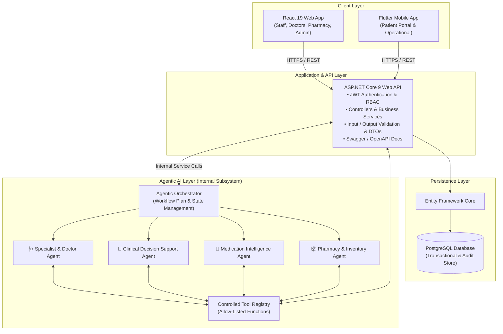
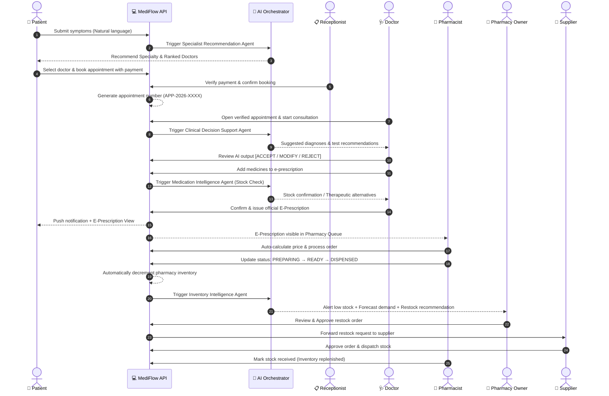

# 🩺 MediFlow AI

> **Intelligent Channeling, E-Prescription & Pharmacy Management System**  
> *An enterprise-grade, multi-agent AI healthcare ecosystem with Human-in-the-Loop clinical decision support.*

[](https://dotnet.microsoft.com/)
[](https://www.postgresql.org/)
[](https://react.dev/)
[](https://flutter.dev/)
[](https://python.org)
[](https://jwt.io/)
[](./LICENSE)

---

## 📑 Table of Contents

- [Overview](#-overview)
- [Core Design Principle: Human-in-the-Loop](#-core-design-principle-human-in-the-loop)
- [System Architecture](#-system-architecture)
- [Agentic AI Ecosystem](#-agentic-ai-ecosystem)
- [End-to-End Healthcare Workflow](#-end-to-end-healthcare-workflow)
- [Technology Stack](#-technology-stack)
- [User Roles & Portals](#-user-roles--portals)
- [Demo Accounts & Seed Credentials](#-demo-accounts--seed-credentials)
- [Repository Structure](#-repository-structure)
- [Getting Started & Local Setup](#-getting-started--local-setup)
  - [Prerequisites](#prerequisites)
  - [1. Database Configuration](#1-database-configuration)
  - [2. Backend Setup (.NET Web API)](#2-backend-setup-net-web-api)
  - [3. Frontend Setup (React Web)](#3-frontend-setup-react-web)
  - [4. AI Subsystem Setup (Python)](#4-ai-subsystem-setup-python)
  - [5. Mobile Setup (Flutter)](#5-mobile-setup-flutter)
- [API Reference](#-api-reference)
- [Key Non-CRUD Business Logic & Algorithms](#-key-non-crud-business-logic--algorithms)
- [Human Approval Pause Points](#-human-approval-pause-points)
- [Safety, Guardrails & Safe Failures](#-safety-guardrails--safe-failures)
- [Testing & Quality Assurance](#-testing--quality-assurance)
- [Project Division & Responsibilities](#-project-division--responsibilities)
- [License](#-license)

---

## 🌟 Overview

**MediFlow AI** is a comprehensive, AI-assisted healthcare channeling, clinical management, electronic prescription, and pharmacy inventory replenishment platform. 

It unifies the full patient consultation and treatment lifecycle into one seamless, cross-platform pipeline:
1. **Patient** enters symptoms in natural language.
2. **AI Specialist Agent** recommends medical specialties and ranks doctors by expertise, rating, and availability.
3. **Patient** books an appointment and completes initial payment.
4. **Receptionist** verifies transaction details, confirms the booking, and generates a structured appointment number (e.g., `APP-2026-1024`).
5. **Doctor** conducts the clinical consultation with real-time **AI Clinical Decision Support** (differential diagnosis suggestions and diagnostic test recommendations).
6. **Doctor** formulates prescription items while the **Medication Intelligence Agent** validates local pharmacy stock availability in real time and suggests alternatives if out-of-stock.
7. **E-Prescription** is issued simultaneously to the patient and the target pharmacy.
8. **Pharmacist** receives the prescription, auto-calculates total pricing, and manages the dispensing workflow (`PENDING` → `CONFIRMED` → `PREPARING` → `READY` → `DISPENSED`).
9. **Inventory Intelligence Agent** monitors stock levels, predicts stock-out dates based on demand velocity, and recommends batch restock orders to the pharmacy owner.
10. **Supplier** reviews and approves restock orders, closing the replenishment loop.

---

## 🛡️ Core Design Principle: Human-in-the-Loop

> **AI agents assist healthcare professionals and patients — they DO NOT independently execute high-impact medical or operational actions.**

All clinical decisions, prescription issuance, payment validations, and restock commitments strictly require authorized human review and explicit confirmation before state changes are committed to the system.

---

## 🏗️ System Architecture

MediFlow AI follows a secure, layered architectural model where the **ASP.NET Core Web API** serves as the single source of truth for business logic, authentication, and database transactions.



---

## 🤖 Agentic AI Ecosystem

The platform features **4 specialized AI Agents** coordinated by a central workflow orchestrator:

| Agent | Module | Primary Purpose | Allow-Listed Tools |
|---|---|---|---|
| 🩺 **Specialist & Doctor Recommendation Agent** | Patient & Channeling | Analyzes symptom text, maps to medical specialties, and calculates ranked doctor recommendations. | `searchSpecialties()`, `searchDoctors()`, `getDoctorRating()`, `getDoctorAvailability()`, `calculateDoctorScore()` |
| 🧠 **Clinical Decision Support Agent** | Clinical & Consultation | Analyzes symptoms, medical history, allergies, vitals, and lab results to produce differential diagnosis candidates with confidence ratings. | `getPatientClinicalData()`, `searchClinicalKnowledge()`, `retrieveSimilarCases()`, `validateDiagnosisOutput()` |
| 💊 **Medication Intelligence Agent** | E-Prescription & Pharmacy | Verifies real-time pharmacy medicine stock during prescription drafting; provides bioequivalent alternative suggestions when out of stock. | `searchMedicine()`, `checkInventory()`, `checkMedicineQuantity()`, `findPotentialAlternatives()`, `validatePrescription()` |
| 📦 **Pharmacy & Inventory Intelligence Agent** | Inventory & Supply Chain | Continuously tracks consumption rates, forecasts stock-out horizons, and generates optimized batch replenishment proposals. | `getInventory()`, `getHistoricalOrders()`, `calculateDemand()`, `forecastDemand()`, `predictStockout()`, `generateRestockRecommendation()` |

---

## 🔄 End-to-End Healthcare Workflow



---

## 💻 Technology Stack

| Layer | Technology | Details |
|---|---|---|
| **Backend API** | ASP.NET Core 9 / C# | Modular REST API, Dependency Injection, Swagger/OpenAPI |
| **ORM & Database** | PostgreSQL + EF Core | Code-First migrations, automated seeding, connection pooling |
| **Security & Auth** | JWT Bearer & BCrypt | Role-Based Access Control (RBAC), Claims-based authorization |
| **Web Client** | React 19 + Vite | SPA architecture, React Router v7, Lucide Icons, Custom Design Tokens |
| **Mobile Client** | Flutter / Dart | Cross-platform mobile (Android/iOS), Provider/Riverpod state |
| **AI Orchestration** | Python / LangGraph / FastAPI | Structured tool-calling, state graphs, deterministic validation |
| **CI / CD & Tooling** | GitHub Actions | Automated build, unit tests, and linting pipelines |

---

## 👥 User Roles & Portals

MediFlow AI incorporates a granular **Role-Based Access Control (RBAC)** model across 7 distinct roles:

```text
┌─────────────────┬───────────────────┬─────────────────────────────────────────────────────────────┐
│ Role            │ Platform / Portal │ Primary Responsibilities                                    │
├─────────────────┼───────────────────┼─────────────────────────────────────────────────────────────┤
│ PATIENT         │ Flutter + React   │ Symptom entry, doctor search, booking, e-prescriptions      │
│ DOCTOR          │ React Web         │ Verified appointments, clinical notes, AI CDS, prescriptions│
│ RECEPTIONIST    │ React Web         │ Payment verification, appointment numbering & scheduling    │
│ PHARMACIST      │ React Web         │ Prescription fulfillment, auto-pricing, dispensing order    │
│ PHARMACY_OWNER  │ React Web         │ Stock oversight, AI demand forecasts, restock approval      │
│ SUPPLIER        │ React Web         │ Restock order approvals, fulfillment, delivery updates      │
│ ADMINISTRATOR   │ React Web         │ User management, system health, audit logs, AI observability│
└─────────────────┴───────────────────┴─────────────────────────────────────────────────────────────┘
```

---

## 🔑 Demo Accounts & Seed Credentials

The database is pre-seeded with ready-to-test accounts across all roles. 

> **Default Seed Password for Staff/Doctor/Admin:** `Staff@123` / `Doctor@123` / `Admin@123`  
> **Default Seed Password for Demo Patient:** `Test@123`

| Role | Email Address | Password | Name / Description |
|---|---|---|---|
| 🧑‍🦱 **Patient** | `dilshan@gmail.com` | `Test@123` | Dilshan Pasindu (Demo Patient) |
| 📋 **Receptionist** | `receptionist@mediflow.lk` | `Staff@123` | Kamani Rajapaksa |
| 🩺 **Doctor (Cardiology)** | `nimal.perera@mediflow.lk` | `Doctor@123` | Dr. Nimal Perera (15 Yrs Exp) |
| 🩺 **Doctor (Dermatology)** | `priya.fernando@mediflow.lk` | `Doctor@123` | Dr. Priya Fernando (10 Yrs Exp) |
| 🩺 **Doctor (General Med)** | `kamal.silva@mediflow.lk` | `Doctor@123` | Dr. Kamal Silva (8 Yrs Exp) |
| 🩺 **Doctor (Neurology)** | `anusha.j@mediflow.lk` | `Doctor@123` | Dr. Anusha Jayawardena (12 Yrs Exp) |
| 💊 **Pharmacist** | `pharmacist@mediflow.lk` | `Staff@123` | Sunil Weerasinghe |
| 🏪 **Pharmacy Owner** | `pharmacyowner@mediflow.lk` | `Staff@123` | Ananda Wickramasinghe |
| 🚚 **Supplier** | `supplier@mediflow.lk` | `Staff@123` | MedPharm Global Supplies |
| 🛡️ **Administrator** | `admin@mediflow.lk` | `Admin@123` | System Administrator |

---

## 📁 Repository Structure

```text
MediFlow-AI-/
├── backend/
│   └── MediFlow.Api/
│       ├── Auth/                 # JWT configuration & authorization handlers
│       ├── Controllers/          # REST API endpoints (Auth, Patient, Doctor, etc.)
│       ├── DTOs/                 # Request & Response data transfer objects
│       ├── Data/                 # AppDbContext & EF Core configuration
│       ├── Migrations/           # Database schema migrations
│       ├── Models/               # PostgreSQL domain entity models
│       ├── Services/             # Business logic services & DatabaseSeeder
│       ├── appsettings.json      # Connection strings & JWT secret settings
│       └── Program.cs            # Application startup & DI configuration
├── web/
│   └── mediflow-web/
│       ├── src/
│       │   ├── components/       # Reusable UI components (Sidebar, Navbar, etc.)
│       │   ├── hooks/            # Custom React hooks
│       │   ├── pages/            # Page components (Login, Dashboard, Booking, etc.)
│       │   ├── services/         # API integration services (Axios / Fetch)
│       │   ├── App.jsx           # Application routing & protected route tree
│       │   └── index.css         # Custom design tokens & global CSS styles
│       ├── package.json          # Node dependencies & scripts
│       └── vite.config.js        # Vite bundler configuration
├── mobile/
│   └── mediflow_mobile/          # Flutter mobile client
├── ai/
│   └── mediflow_agents/          # Python Agentic AI subsystem
│       ├── agents/               # Individual specialized agents (1 to 4)
│       ├── orchestrator/         # LangGraph workflow orchestration
│       ├── tools/                # Allow-listed agent tools
│       └── requirements.txt      # Python dependencies
├── docs/                         # Project documentation, ADRs & AI usage logs
├── tests/                        # Unit, integration & agent evaluation suites
├── .github/                      # CI/CD Workflows
├── LICENSE                       # MIT License
├── MediFlowAI_4_Member_Project_Division.md
└── README.md
```

---

## 🚀 Getting Started & Local Setup

### Prerequisites

Ensure you have the following installed on your machine:
- [.NET 9.0 SDK](https://dotnet.microsoft.com/download)
- [Node.js (v20+ or LTS)](https://nodejs.org/)
- [PostgreSQL (v15+)](https://www.postgresql.org/download/)
- [Python (v3.11+)](https://www.python.org/downloads/) *(for AI subsystem)*
- [Flutter SDK (v3.20+)](https://flutter.dev/docs/get-started/install) *(for mobile)*

---

### 1. Database Configuration

Create a local PostgreSQL database named `mediflow_db`.

Ensure the connection string in `backend/MediFlow.Api/appsettings.json` matches your local database credentials:

```json
{
  "ConnectionStrings": {
    "DefaultConnection": "Host=localhost;Port=5432;Database=mediflow_db;Username=postgres;Password=your_password"
  },
  "Jwt": {
    "Key": "YOUR_SUPER_SECRET_JWT_KEY_AT_LEAST_32_CHARS_LONG",
    "Issuer": "MediFlowApi",
    "Audience": "MediFlowClients"
  }
}
```

---

### 2. Backend Setup (.NET Web API)

```bash
# Navigate to the backend directory
cd backend/MediFlow.Api

# Restore dependencies
dotnet restore

# Run EF Core Migrations (Database will auto-seed on first run)
dotnet ef database update

# Start the ASP.NET Core API server
dotnet run
```

- API Base URL: `http://localhost:5000` (or `https://localhost:7000`)
- **Interactive Swagger UI:** `http://localhost:5000/swagger`

---

### 3. Frontend Setup (React Web)

```bash
# Navigate to the web application directory
cd web/mediflow-web

# Install dependencies
npm install

# Start the development server
npm run dev
```

- Web Client URL: `http://localhost:5173`

---

### 4. AI Subsystem Setup (Python)

```bash
# Navigate to the AI directory
cd ai/mediflow_agents

# Create and activate a virtual environment
python3 -m venv venv
source venv/bin/activate    # On Windows: venv\Scripts\activate

# Install requirements
pip install -r requirements.txt

# Start the internal AI service
uvicorn main:app --host 0.0.0.0 --port 8000 --reload
```

---

### 5. Mobile Setup (Flutter)

```bash
# Navigate to the mobile directory
cd mobile/mediflow_mobile

# Get packages
flutter pub get

# Run on connected device or simulator
flutter run
```

---

## 📡 API Reference

Below is a summary of primary endpoints exposed by the ASP.NET Core API:

### 🔐 Authentication & Accounts
- `POST /api/auth/login` — Authenticate user, return JWT token & role metadata.
- `POST /api/auth/register` — Register a new patient account.
- `GET /api/auth/me` — Retrieve current authenticated user profile.

### 🩺 Patients & Appointments (Member 1)
- `GET /api/patients/{id}` — Retrieve patient demographic & medical details.
- `POST /api/patients/symptoms` — Submit natural language symptom profile.
- `GET /api/doctors` — Search and filter doctor directory.
- `GET /api/doctors/ranked?specialty={id}` — **Non-CRUD:** Retrieve weighted algorithmic doctor recommendations.
- `POST /api/appointments` — Book doctor consultation.
- `GET /api/appointments/my` — Fetch current user's appointment history.
- `POST /api/appointments/{id}/pay` — Process appointment fee transaction.

### 📋 Receptionist Operations
- `GET /api/receptionist/appointments` — View pending appointment bookings.
- `POST /api/receptionist/appointments/{id}/verify` — Verify payment & confirm booking.
- `POST /api/receptionist/appointments/{id}/generate-number` — Generate formatted appointment identifier.

### 🧠 Doctor Consultation & Clinical CDS (Member 2)
- `GET /api/doctors/appointments` — Doctor queue (verified appointments only).
- `POST /api/consultations` — Initialize consultation record.
- `POST /api/clinical-analysis` — **Non-CRUD:** Trigger AI Clinical Decision Support analysis.
- `POST /api/diagnosis/{id}/decision` — Save doctor's explicit `ACCEPT`, `MODIFY`, or `REJECT` decision.

### 💊 E-Prescriptions & Dispensing (Member 3)
- `GET /api/medicines` — Search master medicine inventory catalog.
- `GET /api/pharmacies/{id}/medicine-availability` — Verify stock levels for prescription items.
- `POST /api/prescriptions` — Issue verified e-prescription.
- `POST /api/orders` — Create pharmacy medicine dispensing order.
- `POST /api/orders/{id}/calculate-price` — **Non-CRUD:** Dynamic price calculation with dosage breakdown.
- `PUT /api/orders/{id}/status` — Advance state machine (`PREPARING` → `READY` → `DISPENSED`).

### 📦 Pharmacy Inventory & Suppliers (Member 4)
- `GET /api/pharmacies/{id}/inventory` — Retrieve current stock metrics.
- `GET /api/inventory/low-stock` — Retrieve items below minimum reorder thresholds.
- `POST /api/pharmacies/{id}/generate-restock-recommendations` — **Non-CRUD:** AI-driven stock-out prediction & restock calculator.
- `POST /api/restock-requests` — Create supplier purchase order.
- `POST /api/suppliers/{id}/approve` — Supplier approves restock dispatch.

---

## 🧠 Key Non-CRUD Business Logic & Algorithms

### 1. Doctor Recommendation Scoring Formula
```text
Score = (Specialty Match × 30%) + (Patient Rating × 25%) 
      + (Experience × 15%) + (Review Count × 10%) 
      + (Current Availability × 10%) + (Location & Fee × 10%)
```

### 2. Order Status State Machine
```text
[ PENDING ] ──► [ CONFIRMED ] ──► [ PREPARING ] ──► [ READY ] ──► [ DISPENSED ]
     │
     └───────────────────────────────────────────────────────────► [ CANCELLED ]
```

### 3. Inventory Stock-Out Horizon & Restock Calculation
```text
Demand Rate (units/day)  = Total Units Dispensed (Last 30 Days) / 30
Days Until Stock-Out    = Current Stock Level / Demand Rate
Recommended Restock Qty = (Target Safety Days × Demand Rate) - Current Stock Level
```

---

## ⏸️ Human Approval Pause Points

| # | Trigger Event | Human Approver | Required Action |
|---|---|---|---|
| **1** | Appointment Payment Submitted | 📋 Receptionist | Verify transaction receipt, confirm slot, and generate unique appointment number (`APP-2026-XXXX`). |
| **2** | AI Differential Diagnosis Generated | 🩺 Doctor | Formally review AI suggestions: choose to `ACCEPT`, `MODIFY`, or `REJECT`. |
| **3** | AI Stock Replenishment Alert | 🏪 Pharmacy Owner | Review recommended batch quantity & supplier choice: choose to `APPROVE` or `DISMISS`. |
| **4** | Restock Purchase Order Created | 🚚 Supplier | Validate order feasibility and `APPROVE` or `REJECT` dispatch. |

---

## 🛡️ Safety, Guardrails & Safe Failures

- **Tool Allow-Lists:** AI agents can only invoke registered, deterministic backend tools with strict input schemas.
- **Fail-Safe Fallbacks:**
  - If symptom analysis is ambiguous → defaults safely to **General Medicine**.
  - If agent services become unavailable → presents clean manual search interfaces without crashing.
  - If stock checks fail → flags inventory for manual pharmacist confirmation before dispensing.
- **Audit Logging:** Every AI output, tool invocation, and human decision is timestamped and persisted with audit trails.

---

## 🧪 Testing & Quality Assurance

- **Backend:** XUnit & Moq for unit testing services, controllers, EF Core constraints, and DTO validation.
- **Frontend:** Vitest & React Testing Library for components, routing guards, and user flows.
- **AI Subsystem:** Golden test case evaluation (rule-based precision scoring, deterministic schema validators, and boundary tests).
- **Integration Tests:** Automated end-to-end testing of cross-platform workflows.

```bash
# Run backend tests
cd backend && dotnet test

# Run frontend tests
cd web/mediflow-web && npm test
```

---

## 👥 Project Division & Responsibilities

| Member | Primary Business Area | Agentic AI Contribution | Core Deliverables |
|:---:|---|---|---|
| **Member 1** | **Patient & Appointment Management** | 🩺 **Specialist & Doctor Recommendation Agent** | Patient endpoints, doctor ranking engine, symptom intake, appointment booking. |
| **Member 2** | **Doctor Consultation & Clinical Management** | 🧠 **Clinical Decision Support Agent** | Clinical examination records, consultation workspace, diagnosis suggestion system. |
| **Member 3** | **E-Prescription & Medicine Ordering** | 💊 **Medication Intelligence Agent** | Prescription generation, stock availability validation, pricing engine, dispensing state machine. |
| **Member 4** | **Pharmacy Inventory & Supplier Management** | 📦 **Pharmacy & Inventory Intelligence Agent** | Stock tracking, demand prediction, automated restock recommendations, supplier portal. |

---

## 📄 License

This project is licensed under the MIT License — see the [LICENSE](./LICENSE) file for details.

---

<p align="center">
  <b>MediFlow AI</b> — Advancing healthcare channeling through intelligent, safe multi-agent engineering.
</p>
