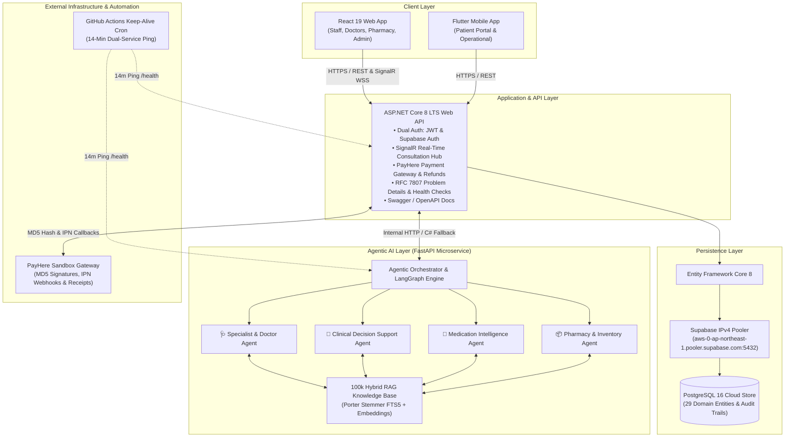
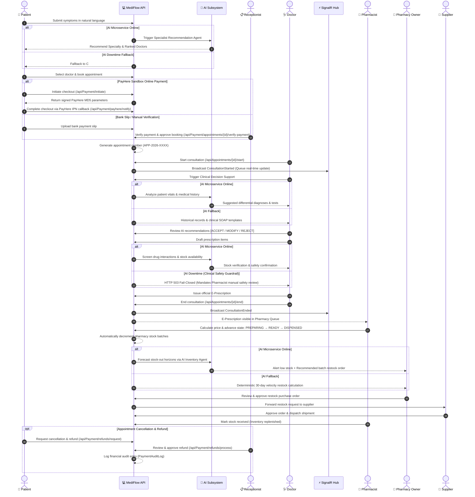

# 🩺 MediFlow AI

> **Intelligent Channeling, E-Prescription & Pharmacy Management System**  
> *An enterprise-grade, multi-agent AI healthcare ecosystem with Human-in-the-Loop clinical decision support.*

[](https://dotnet.microsoft.com/)
[](https://supabase.com/)
[](https://learn.microsoft.com/aspnet/core/signalr/)
[](https://www.payhere.lk/)
[](https://react.dev/)
[](https://flutter.dev/)
[](https://python.org)
[](./tests)
[](https://jwt.io/)
[](./LICENSE)

---

## 📑 Table of Contents

- [Overview](#-overview)
- [Core Design Principle: Human-in-the-Loop](#-core-design-principle-human-in-the-loop)
- [System Architecture](#-system-architecture)
- [Agentic AI Ecosystem](#-agentic-ai-ecosystem)
- [End-to-End Healthcare Workflow](#-end-to-end-healthcare-workflow)
- [Technology Stack](#-technology-stack)
- [User Roles & Portals](#-user-roles--portals)
- [Demo Accounts & Seed Credentials](#-demo-accounts--seed-credentials)
- [Repository Structure](#-repository-structure)
- [Getting Started & Local Setup](#-getting-started--local-setup)
  - [Prerequisites](#prerequisites)
  - [1. Database Configuration](#1-database-configuration)
  - [2. Backend Setup (.NET Web API)](#2-backend-setup-net-web-api)
  - [3. Frontend Setup (React Web)](#3-frontend-setup-react-web)
  - [4. AI Subsystem Setup (Python)](#4-ai-subsystem-setup-python)
  - [5. Mobile Setup (Flutter)](#5-mobile-setup-flutter)
- [API Reference](#-api-reference)
- [Key Non-CRUD Business Logic & Algorithms](#-key-non-crud-business-logic--algorithms)
- [Human Approval Pause Points](#-human-approval-pause-points)
- [Safety, Guardrails & Safe Failures](#-safety-guardrails--safe-failures)
- [Testing & Quality Assurance](#-testing--quality-assurance)
- [Project Division & Responsibilities](#-project-division--responsibilities)
- [License](#-license)

---

## 🌟 Overview

**MediFlow AI** is a comprehensive, AI-assisted healthcare channeling, clinical management, electronic prescription, and pharmacy inventory replenishment platform. 

It unifies the full patient consultation and treatment lifecycle into one seamless, cross-platform pipeline:
1. **Patient** enters symptoms in natural language.
2. **AI Specialist Agent** recommends medical specialties and ranks doctors by expertise, rating, and availability.
3. **Patient** books an appointment and completes initial payment.
4. **Receptionist** verifies transaction details, confirms the booking, and generates a structured appointment number (e.g., `APP-2026-1024`).
5. **Doctor** conducts the clinical consultation with real-time **AI Clinical Decision Support** (differential diagnosis suggestions and diagnostic test recommendations).
6. **Doctor** formulates prescription items while the **Medication Intelligence Agent** validates local pharmacy stock availability in real time and suggests alternatives if out-of-stock.
7. **E-Prescription** is issued simultaneously to the patient and the target pharmacy.
8. **Pharmacist** receives the prescription, auto-calculates total pricing, and manages the dispensing workflow (`PENDING` → `CONFIRMED` → `PREPARING` → `READY` → `DISPENSED`).
9. **Inventory Intelligence Agent** monitors stock levels, predicts stock-out dates based on demand velocity, and recommends batch restock orders to the pharmacy owner.
10. **Supplier** reviews and approves restock orders, closing the replenishment loop.

---

## 🛡️ Core Design Principle: Human-in-the-Loop

> **AI agents assist healthcare professionals and patients — they DO NOT independently execute high-impact medical or operational actions.**

All clinical decisions, prescription issuance, payment validations, and restock commitments strictly require authorized human review and explicit confirmation before state changes are committed to the system.

---

## 🏗️ System Architecture

MediFlow AI follows a secure, layered architectural model where the **ASP.NET Core Web API** serves as the single source of truth for business logic, authentication, and database transactions.


```mermaid
graph TB
    subgraph Clients["Client Layer"]
        ReactWeb["React 19 Web App<br/>(Staff, Doctors, Pharmacy, Admin)"]
        FlutterApp["Flutter Mobile App<br/>(Patient Portal & Operational)"]
    end

    subgraph Gateway["Application & API Layer"]
        DotNetAPI["ASP.NET Core 8 LTS Web API<br/>• Dual Auth: JWT & Supabase Auth<br/>• SignalR Real-Time Consultation Hub<br/>• PayHere Payment Gateway & Refunds<br/>• RFC 7807 Problem Details & Health Checks<br/>• Swagger / OpenAPI Docs"]
    end

    subgraph DataLayer["Persistence Layer"]
        EFCore["Entity Framework Core 8"]
        SupabasePooler["Supabase IPv4 Pooler<br/>(aws-0-ap-northeast-1.pooler.supabase.com:5432)"]
        PostgreSQL[("PostgreSQL 16 Cloud Store<br/>(29 Domain Entities & Audit Trails)")]
    end

    subgraph AISubsystem["Agentic AI Layer (FastAPI Microservice)"]
        Orchestrator["Agentic Orchestrator & LangGraph Engine"]
        Agent1["🩺 Specialist & Doctor Agent"]
        Agent2["🧠 Clinical Decision Support Agent"]
        Agent3["💊 Medication Intelligence Agent"]
        Agent4["📦 Pharmacy & Inventory Agent"]
        KnowledgeBase["100k Hybrid RAG Knowledge Base<br/>(Porter Stemmer FTS5 + Embeddings)"]
    end

    subgraph ExternalServices["External Infrastructure & Automation"]
        PayHere["PayHere Sandbox Gateway<br/>(MD5 Signatures, IPN Webhooks & Receipts)"]
        KeepAliveCron["GitHub Actions Keep-Alive Cron<br/>(14-Min Dual-Service Ping)"]
    end

    ReactWeb -->|HTTPS / REST & SignalR WSS| DotNetAPI
    FlutterApp -->|HTTPS / REST| DotNetAPI
    DotNetAPI <-->|MD5 Hash & IPN Callbacks| PayHere
    DotNetAPI --> EFCore
    EFCore --> SupabasePooler
    SupabasePooler --> PostgreSQL
    KeepAliveCron -.->|14m Ping /health| DotNetAPI
    KeepAliveCron -.->|14m Ping /health| Orchestrator
    DotNetAPI <-->|Internal HTTP / C# Fallback| Orchestrator
    Orchestrator --> Agent1
    Orchestrator --> Agent2
    Orchestrator --> Agent3
    Orchestrator --> Agent4
    Agent1 & Agent2 & Agent3 & Agent4 <--> KnowledgeBase
```

---

## 🤖 Agentic AI Ecosystem

The platform features **4 specialized AI Agents** coordinated by a central workflow orchestrator:

| Agent | Module | Primary Purpose | Allow-Listed Tools |
|---|---|---|---|
| 🩺 **Specialist & Doctor Recommendation Agent** | Patient & Channeling | Analyzes symptom text, maps to medical specialties, and calculates ranked doctor recommendations. | `searchSpecialties()`, `searchDoctors()`, `getDoctorRating()`, `getDoctorAvailability()`, `calculateDoctorScore()` |
| 🧠 **Clinical Decision Support Agent** | Clinical & Consultation | Analyzes symptoms, medical history, allergies, vitals, and lab results to produce differential diagnosis candidates with confidence ratings. | `getPatientClinicalData()`, `searchClinicalKnowledge()`, `retrieveSimilarCases()`, `validateDiagnosisOutput()` |
| 💊 **Medication Intelligence Agent** | E-Prescription & Pharmacy | Verifies real-time pharmacy medicine stock during prescription drafting; provides bioequivalent alternative suggestions when out of stock. | `searchMedicine()`, `checkInventory()`, `checkMedicineQuantity()`, `findPotentialAlternatives()`, `validatePrescription()` |
| 📦 **Pharmacy & Inventory Intelligence Agent** | Inventory & Supply Chain | Continuously tracks consumption rates, forecasts stock-out horizons, and generates optimized batch replenishment proposals. | `getInventory()`, `getHistoricalOrders()`, `calculateDemand()`, `forecastDemand()`, `predictStockout()`, `generateRestockRecommendation()` |

---

## 🔄 End-to-End Healthcare Workflow


```mermaid
sequenceDiagram
    autonumber
    actor Patient as 👤 Patient
    participant System as 💻 MediFlow API
    participant AI as 🤖 AI Subsystem
    actor Receptionist as 📋 Receptionist
    actor Doctor as 🩺 Doctor
    participant SignalR as ⚡ SignalR Hub
    actor Pharmacist as 💊 Pharmacist
    actor Owner as 🏪 Pharmacy Owner
    actor Supplier as 🚚 Supplier

    %% 1. Triage & Booking
    Patient->>System: Submit symptoms in natural language
    alt AI Microservice Online
        System->>AI: Trigger Specialist Recommendation Agent
        AI-->>Patient: Recommend Specialty & Ranked Doctors
    else AI Downtime Fallback
        System-->>Patient: Fallback to C# Clinical Rule Engine (17 Specialties + Triage)
    end
    Patient->>System: Select doctor & book appointment

    %% 2. Payment & Verification
    alt PayHere Sandbox Online Payment
        Patient->>System: Initiate checkout (/api/Payment/initiate)
        System-->>Patient: Return signed PayHere MD5 parameters
        Patient->>System: Complete checkout via PayHere IPN callback (/api/Payment/payhere/notify)
    else Bank Slip / Manual Verification
        Patient->>System: Upload bank payment slip
        Receptionist->>System: Verify payment & approve booking (/api/Payment/appointments/{id}/verify-payment)
    end
    System-->>System: Generate appointment number (APP-2026-XXXX)

    %% 3. Consultation & SignalR Queue Broadcast
    Doctor->>System: Start consultation (/api/Appointments/{id}/start)
    System->>SignalR: Broadcast ConsultationStarted (Queue real-time update)
    Doctor->>System: Trigger Clinical Decision Support
    alt AI Microservice Online
        System->>AI: Analyze patient vitals & medical history
        AI-->>Doctor: Suggested differential diagnoses & tests
    else AI Fallback
        System-->>Doctor: Historical records & clinical SOAP templates
    end
    Doctor->>System: Review AI recommendations [ACCEPT / MODIFY / REJECT]

    %% 4. Prescription & Safe Dispensing
    Doctor->>System: Draft prescription items
    alt AI Microservice Online
        System->>AI: Screen drug interactions & stock availability
        AI-->>Doctor: Stock verification & safety confirmation
    else AI Downtime (Clinical Safety Guardrail)
        System-->>Doctor: HTTP 503 Fail-Closed (Mandates Pharmacist manual safety review)
    end
    Doctor->>System: Issue official E-Prescription
    Doctor->>System: End consultation (/api/Appointments/{id}/end)
    System->>SignalR: Broadcast ConsultationEnded

    %% 5. Dispensing & Automatic Inventory Decrement
    System-->>Pharmacist: E-Prescription visible in Pharmacy Queue
    Pharmacist->>System: Calculate price & advance state: PREPARING → READY → DISPENSED
    System-->>System: Automatically decrement pharmacy stock batches

    %% 6. Predictive Inventory & Supply Chain
    alt AI Microservice Online
        System->>AI: Forecast stock-out horizons via AI Inventory Agent
        AI-->>Owner: Alert low stock + Recommended batch restock order
    else AI Fallback
        System-->>Owner: Deterministic 30-day velocity restock calculation
    end
    Owner->>System: Review & approve restock purchase order
    System->>Supplier: Forward restock request to supplier
    Supplier->>System: Approve order & dispatch shipment
    Pharmacist->>System: Mark stock received (Inventory replenished)

    %% 7. Cancellation & Refund Lifecycle
    opt Appointment Cancellation & Refund
        Patient->>System: Request cancellation & refund (/api/Payment/refunds/request)
        Receptionist->>System: Review & approve refund (/api/Payment/refunds/process)
        System-->>System: Log financial audit entry (PaymentAuditLog)
    end
```

---

## 💻 Technology Stack

| Layer | Technology | Details |
|---|---|---|
| **Web Client** | React 19 + TypeScript (Strict) + Vite 8 | SPA architecture, Tailwind CSS 4, TanStack Query 5, Zustand 5, React Router 7, Zod, Lucide React, SignalR client |
| **Backend API** | ASP.NET Core 8 LTS / C# 12 | Modular REST API, Dependency Injection, RFC 7807 Problem Details, Health Checks, Swagger/OpenAPI, SignalR Hubs |
| **Real-Time Engine** | ASP.NET Core SignalR WebSockets | Real-time queue tracker (`/hubs/consultation`), live doctor consultation events (`ConsultationStarted`, `ConsultationEnded`) |
| **Payment Gateway** | PayHere Sandbox + Audit Store | MD5 signature hashing, IPN webhook notification handling, full refund approval state machine, immutable `PaymentAuditLog` |
| **ORM & Database** | PostgreSQL 16 + EF Core 8 (Supabase Pooler) | 29 domain entities, code-first migrations, automated seeding, IPv4 pooler routing (`aws-0-ap-northeast-1.pooler.supabase.com:5432`) |
| **Security & Auth** | Dual Auth: JWT Bearer & Supabase Auth | Role-Based Access Control (RBAC), BCrypt password hashing, staff-role latency bypass for immediate token validation |
| **Mobile Client** | Flutter / Dart | Cross-platform mobile (Android/iOS), Riverpod state management, GoRouter |
| **AI Subsystem** | Python 3.11 / FastAPI / LangGraph | 100k Hybrid RAG Knowledge Base (Porter Stemmer FTS5 + Embeddings), Pydantic v2 deterministic validation, graceful C# rule engine fallbacks |
| **Testing & QA** | Vitest, RTL, xUnit, Pytest | 139 xUnit backend unit/integration tests (100% pass) + 109 Pytest AI tests (100% pass) + Vitest frontend suites |
| **CI / CD & Tooling** | GitHub Actions & Docker | Automated CI/CD (`ci.yml`, `cd.yml`), CodeQL security scanning, 14-min keep-alive monitoring (`keep-ai-alive.yml`), multi-stage Dockerfiles |

---

## 👥 User Roles & Portals

MediFlow AI incorporates a granular **Role-Based Access Control (RBAC)** model across 7 distinct roles:

```text
┌─────────────────┬───────────────────┬─────────────────────────────────────────────────────────────┐
│ Role            │ Platform / Portal │ Primary Responsibilities                                    │
├─────────────────┼───────────────────┼─────────────────────────────────────────────────────────────┤
│ PATIENT         │ Flutter + React   │ Symptom entry, doctor search, booking, e-prescriptions      │
│ DOCTOR          │ React Web         │ Verified appointments, clinical notes, AI CDS, prescriptions│
│ RECEPTIONIST    │ React Web         │ Payment verification, appointment numbering & scheduling    │
│ PHARMACIST      │ React Web         │ Prescription fulfillment, auto-pricing, dispensing order    │
│ PHARMACY_OWNER  │ React Web         │ Stock oversight, AI demand forecasts, restock approval      │
│ SUPPLIER        │ React Web         │ Restock order approvals, fulfillment, delivery updates      │
│ ADMINISTRATOR   │ React Web         │ User management, system health, audit logs, AI observability│
└─────────────────┴───────────────────┴─────────────────────────────────────────────────────────────┘
```

---

## 🔑 Demo Accounts & Seed Credentials

The database is pre-seeded with ready-to-test accounts across all roles. 

> **Default Seed Password for Staff/Doctor/Admin:** `Staff@123` / `Doctor@123` / `Admin@123`  
> **Default Seed Password for Demo Patient:** `Test@123`

| Role | Email Address | Password | Name / Description |
|---|---|---|---|
| 🧑‍🦱 **Patient** | `dilshan@gmail.com` | `Test@123` | Dilshan Pasindu (Demo Patient) |
| 📋 **Receptionist** | `receptionist@mediflow.lk` | `Staff@123` | Kamani Rajapaksa |
| 🩺 **Doctor (Cardiology)** | `nimal.perera@mediflow.lk` | `Doctor@123` | Dr. Nimal Perera (15 Yrs Exp) |
| 🩺 **Doctor (Dermatology)** | `priya.fernando@mediflow.lk` | `Doctor@123` | Dr. Priya Fernando (10 Yrs Exp) |
| 🩺 **Doctor (General Med)** | `kamal.silva@mediflow.lk` | `Doctor@123` | Dr. Kamal Silva (8 Yrs Exp) |
| 🩺 **Doctor (Neurology)** | `anusha.j@mediflow.lk` | `Doctor@123` | Dr. Anusha Jayawardena (12 Yrs Exp) |
| 💊 **Pharmacist** | `pharmacist@mediflow.lk` | `Staff@123` | Sunil Weerasinghe |
| 🏪 **Pharmacy Owner** | `pharmacyowner@mediflow.lk` | `Staff@123` | Ananda Wickramasinghe |
| 🚚 **Supplier** | `supplier@mediflow.lk` | `Staff@123` | MedPharm Global Supplies |
| 🛡️ **Administrator** | `admin@mediflow.lk` | `Admin@123` | System Administrator |

---

## 📁 Repository Structure

```text
MediFlow-AI-/
├── backend/
│   ├── Controllers/          # REST API endpoints (Auth, Patient, Doctor, etc.)
│   ├── DTOs/                 # Request & Response data transfer objects
│   ├── Data/                 # AppDbContext & EF Core configuration
│   ├── Migrations/           # Database schema migrations
│   ├── Models/               # PostgreSQL domain entity models
│   ├── Services/             # Business logic services & DatabaseSeeder
│   ├── MediFlow.Api.csproj   # ASP.NET Core Web API project configuration
│   ├── appsettings.json      # Connection strings & JWT secret settings
│   ├── Program.cs            # Application startup, DI & middleware configuration
│   └── Dockerfile            # Multi-stage production container build
├── frontend/
│   ├── src/
│   │   ├── components/       # Reusable UI components & shadcn-inspired primitives
│   │   ├── hooks/            # TanStack React Query server-state hooks
│   │   ├── pages/            # Lazy-loaded page components (Login, Dashboard, etc.)
│   │   ├── services/         # Typed API integration services (Axios)
│   │   ├── stores/           # Zustand client-state stores (authStore)
│   │   ├── schemas/          # Zod validation schemas (auth, profile, booking, consultation)
│   │   ├── types/            # TypeScript type declarations & DTO interfaces
│   │   ├── test/             # Vitest test specifications
│   │   ├── App.tsx           # Application routing, Suspense fallback & route tree
│   │   └── index.css         # Tailwind CSS 4 design tokens & global styles
│   ├── Dockerfile            # Multi-stage Nginx production container build
│   ├── package.json          # Node dependencies & Vitest scripts
│   └── vite.config.ts        # Vite 8 configuration with vendor chunk splitting
├── ai/
│   ├── agents/               # Agentic workflows & clinical decision recommenders
│   ├── schemas/              # Pydantic v2 request/response models
│   ├── tests/                # Pytest test suite
│   ├── main.py               # FastAPI service definition & endpoints
│   ├── requirements.txt      # Python dependencies
│   └── Dockerfile            # AI microservice container build
├── mobile/
│   ├── lib/                  # Flutter Dart application code
│   │   ├── providers/        # Riverpod state providers (auth, appointment)
│   │   ├── screens/          # Mobile UI screens (login, home)
│   │   └── main.dart         # Mobile application entry point
│   ├── android/              # Android platform files & build configurations
│   ├── ios/                  # iOS platform files & Xcode project
│   └── pubspec.yaml          # Flutter dependencies & metadata
├── tests/
│   └── MediFlow.Tests/           # xUnit backend unit & WebApplicationFactory tests
├── .github/workflows/            # GitHub Actions CI/CD, CodeQL & Security guardrails
├── docker-compose.yml            # Multi-service local & staging orchestration
├── LICENSE                       # MIT License
└── README.md                     # Project documentation & reference
```

---

## 🚀 Getting Started & Local Setup

### Prerequisites

Ensure you have the following installed on your machine:
- [.NET 8.0 LTS SDK](https://dotnet.microsoft.com/download)
- [Node.js (v20+ LTS)](https://nodejs.org/)
- [PostgreSQL (v16+)](https://www.postgresql.org/download/)
- [Python (v3.11+)](https://www.python.org/downloads/) *(for AI subsystem)*
- [Flutter SDK (v3.20+)](https://flutter.dev/docs/get-started/install) *(for mobile)*

---

### 1. Database Configuration

Create a local PostgreSQL database named `mediflow_db`.

Ensure the connection string in `backend/appsettings.json` matches your local database credentials:

```json
{
  "ConnectionStrings": {
    "DefaultConnection": "Host=localhost;Port=5432;Database=mediflow_db;Username=postgres;Password=your_password"
  },
  "Jwt": {
    "Key": "YOUR_SUPER_SECRET_JWT_KEY_AT_LEAST_32_CHARS_LONG",
    "Issuer": "MediFlowApi",
    "Audience": "MediFlowClients"
  }
}
```

---

### 2. Backend Setup (.NET Web API)

```bash
# Navigate to the backend directory
cd backend

# Restore dependencies
dotnet restore

# Run EF Core Migrations (Database will auto-seed on first run)
dotnet ef database update

# Start the ASP.NET Core API server
dotnet run
```

- API Base URL: `http://localhost:5224` (or `http://localhost:5000` via Docker)
- **Interactive Swagger UI:** `http://localhost:5224/swagger`
- **Health Check Endpoint:** `http://localhost:5224/health`

---

### 3. Frontend Setup (React Web)

```bash
# Navigate to the frontend application directory
cd frontend

# Install dependencies
npm install

# Start the development server
npm run dev
```

- Web Client URL: `http://localhost:5173`

---

### 4. AI Subsystem Setup (Python)

```bash
# Navigate to the root or ai directory
cd ai

# Create and activate a virtual environment
python3 -m venv venv
source venv/bin/activate    # On Windows: venv\Scripts\activate

# Install requirements
pip install -r requirements.txt

# Start the internal AI service (when inside ai/ directory)
uvicorn main:app --host 0.0.0.0 --port 8000 --reload

# Alternatively, from the repository root:
# uvicorn ai.main:app --host 0.0.0.0 --port 8000 --reload
```

- AI Service URL: `http://localhost:8000`
- AI Health Probe: `http://localhost:8000/health`
- Recommendation Endpoint: `POST http://localhost:8000/api/ai/recommend-specialist`

#### Render Deployment, Supabase IPv4 Pooler & Keep-Alive Workflow
- **Supabase IPv4 Pooler Integration:** When deployed on Render's free-tier Linux containers, direct outbound connections to Supabase hostnames (`db.<project_ref>.supabase.co`) fail with `SocketException (101): Network unreachable` due to platform IPv6 constraints. MediFlow API automatically detects this and translates the connection to the Supabase IPv4 transaction/session pooler (`aws-0-ap-northeast-1.pooler.supabase.com:5432`) with user `postgres.<project_ref>` and IPv4 address pre-resolution.
- **Render Free-Tier Keep-Alive:** Render free-tier web services automatically spin down after 15 minutes of inactivity. MediFlow includes a scheduled GitHub Actions health-check workflow:
  - **Workflow File:** [keep-ai-alive.yml](file:///.github/workflows/keep-ai-alive.yml) (Runs every 14 minutes and supports manual triggers).
  - **Dual-Service Probe:** Pings both `AI_SERVICE_URL` (`/health`) and `BACKEND_URL` (`/health`) to keep containers warm and avoid cold-start delays.
  - **Setup Guide:** See [RENDER_AI_SERVICE_KEEP_ALIVE.md](file:///docs/RENDER_AI_SERVICE_KEEP_ALIVE.md) for GitHub Secrets configuration and troubleshooting.

---

### 5. Mobile Setup (Flutter)

```bash
# Navigate to the mobile directory
cd mobile

# Get packages
flutter pub get

# Run on connected device or simulator
flutter run
```

---

## 📡 API Reference

Below is a summary of primary endpoints exposed by the ASP.NET Core API:

### 🔐 Authentication & Accounts
- `POST /api/auth/login` — Authenticate user, return JWT token & role metadata.
- `POST /api/auth/register` — Register a new patient account.
- `GET /api/auth/me` — Retrieve current authenticated user profile.

### 🩺 Patients & Appointments (Member 1)
- `GET /api/Patients/{id}` — Retrieve patient demographic & medical details.
- `POST /api/Patients/symptoms` — Submit natural language symptom profile.
- `GET /api/Doctors` — Search and filter doctor directory.
- `GET /api/Doctors/ranked?specialty={id}` — **Non-CRUD:** Retrieve weighted algorithmic doctor recommendations.
- `POST /api/Appointments` — Book doctor consultation.
- `GET /api/Appointments/{id}` — Retrieve comprehensive appointment details.
- `GET /api/Appointments/my` — Fetch current user's appointment history.
- `POST /api/Appointments/{id}/pay` — Process appointment fee transaction or receipt upload.
- `POST /api/Appointments/{id}/start` — Start consultation and broadcast `ConsultationStarted` via SignalR.
- `POST /api/Appointments/{id}/end` — Complete consultation and broadcast `ConsultationEnded` via SignalR.
- `GET /api/Appointments/current-consultation` — Real-time queue tracker for currently consulting patient.
- `WebSocket /hubs/consultation` — SignalR real-time consultation hub for live queue synchronization.

### 💳 PayHere Payments & Refunds (Member 1)
- `POST /api/Payment/initiate` — Generate pre-signed PayHere MD5 checkout parameters for sandbox checkout.
- `POST /api/Payment/payhere/notify` — PayHere IPN webhook callback with signature verification & automated booking confirmation.
- `POST /api/Payment/appointments/{id}/verify-payment` — Receptionist manual payment slip verification & approval.
- `POST /api/Payment/appointments/{id}/cancel` — Cancel appointment and initiate refund workflow.
- `POST /api/Payment/refunds/{id}/request` — Submit patient refund request with banking details.
- `POST /api/Payment/refunds/{id}/process` — Staff approve or reject refund request with gateway reference.
- `GET /api/Payment/refunds/pending` — Fetch pending refund requests awaiting staff review.
- `GET /api/Payment/audit-logs` — Immutable financial audit trail with actor, action, and gateway references.

### 📋 Receptionist & Admin Operations
- `GET /api/Appointments` — View all appointment bookings with status filters.
- `GET /api/Admin/users` — Paginated user management table with approval actions.
- `PATCH /api/Admin/users/{id}/approve` — Approve pending staff/doctor account registrations.
- `POST /api/Admin/specialties` — Provision new medical specialty.
- `GET /api/Admin/audit-logs` — Query security audit logs with timestamp filtering.

### 🧠 Doctor Consultation & Clinical CDS (Member 2)
- `GET /api/doctors/appointments` — Doctor queue (verified appointments only).
- `POST /api/consultations` — Initialize consultation record.
- `POST /api/clinical-analysis` — **Non-CRUD:** Trigger AI Clinical Decision Support analysis.
- `POST /api/diagnosis/{id}/decision` — Save doctor's explicit `ACCEPT`, `MODIFY`, or `REJECT` decision.

### 💊 E-Prescriptions & Dispensing (Member 3)
- `GET /api/medicines` — Search master medicine inventory catalog.
- `GET /api/pharmacies/{id}/medicine-availability` — Verify stock levels for prescription items.
- `POST /api/prescriptions` — Issue verified e-prescription.
- `POST /api/orders` — Create pharmacy medicine dispensing order.
- `POST /api/orders/{id}/calculate-price` — **Non-CRUD:** Dynamic price calculation with dosage breakdown.
- `PUT /api/orders/{id}/status` — Advance state machine (`PREPARING` → `READY` → `DISPENSED`).

### 📦 Pharmacy Inventory & Suppliers (Member 4)
- `GET /api/pharmacies/{id}/inventory` — Retrieve current stock metrics.
- `GET /api/inventory/low-stock` — Retrieve items below minimum reorder thresholds.
- `POST /api/pharmacies/{id}/generate-restock-recommendations` — **Non-CRUD:** AI-driven stock-out prediction & restock calculator.
- `POST /api/restock-requests` — Create supplier purchase order.
- `POST /api/suppliers/{id}/approve` — Supplier approves restock dispatch.

---

## 🧠 Key Non-CRUD Business Logic & Algorithms

### 1. Doctor Recommendation Scoring Formula
```text
Score = (Specialty Match × 30%) + (Patient Rating × 25%) 
      + (Experience × 15%) + (Review Count × 10%) 
      + (Current Availability × 10%) + (Location & Fee × 10%)
```

### 2. Order Status State Machine
```text
[ PENDING ] ──► [ CONFIRMED ] ──► [ PREPARING ] ──► [ READY ] ──► [ DISPENSED ]
     │
     └───────────────────────────────────────────────────────────► [ CANCELLED ]
```

### 3. Inventory Stock-Out Horizon & Restock Calculation
```text
Demand Rate (units/day)  = Total Units Dispensed (Last 30 Days) / 30
Days Until Stock-Out    = Current Stock Level / Demand Rate
Recommended Restock Qty = (Target Safety Days × Demand Rate) - Current Stock Level
```

---

## ⏸️ Human Approval Pause Points

| # | Trigger Event | Human Approver | Required Action |
|---|---|---|---|
| **1** | Appointment Payment Submitted | 📋 Receptionist | Verify transaction receipt, confirm slot, and generate unique appointment number (`APP-2026-XXXX`). |
| **2** | AI Differential Diagnosis Generated | 🩺 Doctor | Formally review AI suggestions: choose to `ACCEPT`, `MODIFY`, or `REJECT`. |
| **3** | AI Stock Replenishment Alert | 🏪 Pharmacy Owner | Review recommended batch quantity & supplier choice: choose to `APPROVE` or `DISMISS`. |
| **4** | Restock Purchase Order Created | 🚚 Supplier | Validate order feasibility and `APPROVE` or `REJECT` dispatch. |

---

## 🛡️ Safety, Guardrails & Safe Failures

- **Tool Allow-Lists:** AI agents can only invoke registered, deterministic backend tools with strict input schemas.
- **Graceful AI Downtime Strategy (3-Tier Safe Failure):**
  - **🩺 Specialist Recommendation Fallback:** If the Python FastAPI service is offline, unreachable, or times out, the backend automatically fails over to an internal C# clinical rule engine covering **17 medical specialties** and emergency triage red-flag detection. The patient receives clear specialty recommendations without service disruption.
  - **💊 Medication Safety Fallback (Clinical Guardrail):** If the AI service is unavailable during prescription drafting or dispensing safety screening, the system **fails closed** with an HTTP 503 error instructing the doctor/pharmacist: *"AI medication check unavailable. Please perform manual clinical drug-interaction review."* Patient safety is never compromised by hallucinated approvals.
  - **📦 Inventory Forecasting Fallback:** If the AI demand predictor is offline, the backend seamlessly calculates reorder points using its internal **30-day velocity demand model** (`TotalDispensedLast30Days / 30 * SafetyDays`).
- **Audit Logging:** Every AI output, tool invocation, human approval/rejection decision, and financial transaction is timestamped and persisted with audit trails (`AuditLogs` and `PaymentAuditLogs`).

---

## 🧪 Testing & Quality Assurance

MediFlow AI enforces a rigorous automated testing standard across all tiers:

- **Backend Unit & Integration Tests (`tests/MediFlow.Tests`)**:
  - Built with **xUnit**, **Moq**, and **EF Core In-Memory Database Provider**.
  - Covers appointment status lifecycles, PayHere MD5 hash verification, batch expiry logic (`EXPIRED`, `CRITICAL`, `EXPIRING_SOON`, `GOOD`), refund processing, and claims-based authorization.
  - **Current Status**: **139 / 139 tests passing** with 0 failures (100% pass rate).
- **AI Microservice Tests (`ai/tests`)**:
  - Built with **Pytest** and **FastAPI TestClient**.
  - Validates Pydantic schemas, 100k Hybrid RAG Knowledge Base indexing, Porter Stemmer FTS5 search, emergency triage red-flags, and dosage safety guardrails.
  - **Current Status**: **109 / 109 tests passing** with 0 failures (100% pass rate).
- **Frontend Quality**:
  - Built with **Vitest** and **React Testing Library** for components, state stores, and user flows; strict TypeScript type-checking with 0 errors.
- **Mobile Subsystem**:
  - Flutter widget and unit tests for Riverpod state providers and navigation.

```bash
# Run backend tests (139 unit & integration tests)
dotnet test MediFlow.sln

# Run AI microservice tests (109 pytest tests)
cd ai && python3 -m pytest tests/

# Run frontend tests (Vitest + React Testing Library)
cd frontend && npm test

# Run mobile client tests (Flutter)
cd mobile && flutter test
```

---

## 👥 Project Division & Responsibilities

| Member | Primary Business Area | Agentic AI Contribution | Core Deliverables |
|:---:|---|---|---|
| **Member 1** | **Patient & Appointment Management** | 🩺 **Specialist & Doctor Recommendation Agent** | Patient endpoints, doctor ranking engine, symptom intake, appointment booking. |
| **Member 2** | **Doctor Consultation & Clinical Management** | 🧠 **Clinical Decision Support Agent** | Clinical examination records, consultation workspace, diagnosis suggestion system. |
| **Member 3** | **E-Prescription & Medicine Ordering** | 💊 **Medication Intelligence Agent** | Prescription generation, stock availability validation, pricing engine, dispensing state machine. |
| **Member 4** | **Pharmacy Inventory & Supplier Management** | 📦 **Pharmacy & Inventory Intelligence Agent** | Stock tracking, demand prediction, automated restock recommendations, supplier portal. |

---

## 📄 License

This project is licensed under the MIT License — see the [LICENSE](./LICENSE) file for details.

---

<p align="center">
  <b>MediFlow AI</b> — Advancing healthcare channeling through intelligent, safe multi-agent engineering.
</p>
